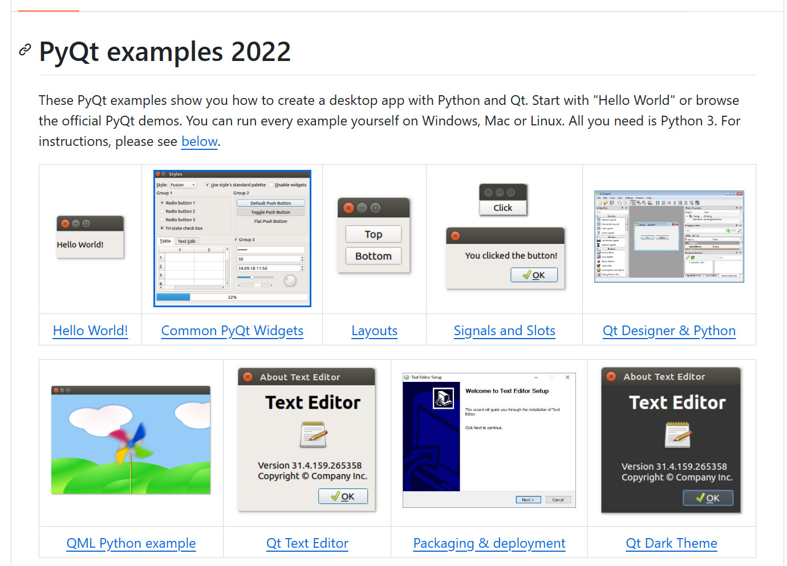

# 准备工作

时间：`2026年8月1日`

**参考资料：**

- 教程1：[Github：最良心的 Python 教程](https://github.com/walter201230/Python/tree/master/Article/PythonBasis)
- 教程2：[菜鸟教程](https://www.runoob.com/python3/python3-tutorial.html)
- 教程3：[游戏式教程codedex](https://www.codedex.io/)

## 简介

### 简明介绍

Python 是一门高级、解释型、通用的编程语言，由 Guido van Rossum 于 1991 年发布。它强调代码的可读性与简洁性，**语法设计哲学是"简洁、可读、明确"，推崇"明确胜于隐晦"、"简单胜于复杂"**，追求用更少的代码表达更多的意图 

- 语法简洁，近乎自然语言：Python 程序读起来像英语，缩进本身就是语法结构，不需要花括号或分号 
- 跨平台：可在 Windows、macOS、Linux 上无缝运行 
- 生态丰富：通过 PyPI（Python Package Index）拥有海量第三方库，覆盖 Web、数据科学、AI、自动化等领域
- "胶水"特性：能轻松调用 C/C++、Java 等其他语言的模块

### 优缺点

-  **优点**：Python 是高级编程语言，它能够快速地进行开发
   - Python 为我们提供了非常完善的基础代码库，覆盖了网络、文件、GUI、数据库、文本等大量内容，被形象地称作 **“内置电池（batteries included）”**。用 Python 开发，许多功能不必从零编写，直接使用现成的即可。
   -  Python 还能开发网站，多大型网站就是用 Python 开发的，例如 YouTube、Instagram，还有国内的豆瓣。很多大公司，包括 Google、Yahoo 等，甚至 NASA（美国航空航天局）都大量地使用 Python。
-  **缺点**
   -  运行速度慢：和C程序相比非常慢，因为Python是解释型语言，你的代码在执行时会一行一行地翻译成CPU能理解的机器码，这个翻译过程非常耗时，所以很慢。而C程序是运行前直接编译成CPU能执行的机器码，所以非常快。
   - 代码不能加密：如果要发布你的 Python 程序，实际上就是发布源代码。像 JAVA, C 这些编译型的语言，都没有这个问题，而解释型的语言，则必须把源码发布出去。

### 应用场景

#### 一、Python 通用热门用途

**1. 数据科学与机器学习（最核心领域）**

Python 在这个领域占据统治地位。核心库包括 `NumPy`/`Pandas`（数据处理）、`Matplotlib`/`Seaborn`（可视化）、`Scikit-learn`（传统机器学习），以及 `TensorFlow`/`PyTorch`（深度学习）。应用覆盖金融风控、医疗影像、推荐系统、自然语言处理等。

**2. Web 开发与后端服务**

三大主流框架各有侧重：**Django**（"全家桶"，适合大型商业应用）、**Flask**（轻量灵活，适合 API 服务）、**FastAPI**（新兴高性能框架，自动生成 API 文档）。Instagram、Pinterest、Dropbox 等知名公司的后端大量使用 Python。

**3. 自动化脚本与运维**

**Python 被誉为系统管理员的"瑞士军刀"**，用于文件批量处理、日志分析、系统监控。网络爬虫方面有 `Scrapy`、`Requests`、`BeautifulSoup` 等成熟工具；DevOps 领域有 `Ansible` 实现基础设施即代码。

**4. 桌面 GUI 应用**

2026 年 Python 的 GUI 生态正在进化，出现了多个现代化界面库。可通过 `PyQt`、`Tkinter`、`Kivy` 等开发跨平台桌面应用。



**5. 新兴领域**

- **嵌入式/IoT**：`MicroPython` 和 `CircuitPython` 让硬件编程更友好
- **量子计算**：IBM Qiskit、Google Cirq 等框架均以 Python 为主要接口
- **MLOps**：`Ray`、`Kubeflow` 等工具推动机器学习模型部署与运维成熟

#### 二、生命科学科研领域应用

**1. 基因组学与测序数据分析**

- **序列处理与比对**：使用 `Biopython` 解析 FASTA/FASTQ/GenBank 等格式，执行全局比对（Needleman-Wunsch）、局部比对（Smith-Waterman）和 BLAST 自动化流水线
- **基因组组装**：从短读段（reads）重建染色体大片段，使用 De Bruijn 图等算法，评估组装质量（N50/N75）
- **变异检测（SNP/InDel）**：通过 `pysam`、`PyVCF`、`HTSeq` 处理 BAM/VCF 文件，发现基因组变异
- **基因预测与注释**：识别开放阅读框（ORF）、功能注释、基因本体论（GO）分析

**2. 转录组学与单细胞数据分析**

- **RNA-seq 数据分析**：基因表达定量、差异表达分析
- **单细胞 RNA-seq（scRNA-seq）**：使用 `Scanpy` 等库进行细胞聚类、降维可视化（t-SNE/UMAP）、拟时序分析、细胞通讯分析
- **基因表达统计**：利用 `pandas`/`NumPy` 处理表达矩阵，筛选差异基因

**3. 蛋白质组学与结构生物学**

- **蛋白质结构分析**：使用 `Biopython` 的 PDB 模块解析 PDB 文件，进行蛋白质几何分析
- **分子可视化**：`PyMOL`（基于 Python 的脚本接口）用于蛋白质三维结构可视化、分子对接结果展示和 MD 轨迹动画制作
- **分子动力学模拟分析**：使用 `MDAnalysis`、`MDTraj` 等库分析 GROMACS/Amber/NAMD 等软件产生的模拟轨迹
- **计算质谱**：蛋白质质谱数据分析、肽段推断、光谱比对

**4. 系统发育与进化生物学**

- **多序列比对**：调用 ClustalW、MAFFT 等工具，使用 `Bio.AlignIO` 处理比对结果
- **系统发育树构建**：使用 `Bio.Phylo`、`DendroPy` 构建和可视化进化树，进行距离计算和树比较
- **群体遗传学**：主成分分析（PCA）、FST 计算、群体结构分析
- **基因组进化**：比较基因组学、基因家族进化分析、共线性分析

**5. 药物发现与化学信息学**

- **分子处理与描述符计算**：`RDKit` 是药物化学和化学信息学的核心库，用于分子读写、子结构搜索、分子描述符计算
- **虚拟筛选与分子对接**：结合深度学习模型和分子对接程序进行药物虚拟筛选
- **Dash Bio**：用于构建生物信息学和药物开发交互式 Web 应用

**6. 宏基因组学与微生物学**

- **宏基因组分析**：物种分类鉴定（基于序列比对）、功能注释
- **微生物群落分析**：多样性分析、物种丰度统计

**7. 机器学习与 AI 在生物学中的应用**

- **生物数据建模**：`scikit-learn` 用于分类、聚类、随机森林等
- **深度学习**：`PyTorch`/`TensorFlow` 用于蛋白质结构预测、基因组序列预测、医学影像分析
- **MLOps**：`Ray`、`Kubeflow` 等用于模型训练和部署

**8. 自动化分析流水线与工作流管理**

- **Snakemake/Nextflow**：构建可复现的生物信息学分析流水线
- **Galaxy**：通过 Python API 与 Galaxy 生物信息学平台交互
- **大规模并行计算**：`Dask`、`Spark` 处理超大规模生物数据集

**9. 数据可视化**

- **统计绘图**：`Matplotlib`、`Seaborn`、`Plotly` 绘制火山图、热图、聚类图、表达趋势图
- **交互式可视化**：Jupyter Notebook/Lab 整合代码、图表和叙述，便于科研协作
- **基因组浏览器**：使用 Python 构建自定义基因组浏览器轨迹图

---

## IDE 及 Editor

- Pycharm
- 环境变量
- VS Code 插件：右上角 `Run Code`（[[0-准备工作.py]]）
  - > 一开始写 Python 程序，个人不太建议用专门的工具来写，不方便熟悉语法，所以这里我先用 Sublime Text 来写，后期可以改为用 PyCharm 
  - pwsh 不显示中文的解决方案：
    - 打开vscode设置
    - 在搜索框中输入 `executorMap`
    - 编辑 `settings.json`：找到 "Code-runner: Executor Map" 这一项，然后点击下面的 "在 settings.json 中编辑"
    - 在打开的 `settings.json` 文件中，找到 "code-runner.executorMap" 的部分，为 `"python"` 加上 `-X utf8` 启动标志（直接加在引号中，最后）

---

## `.py` 文件的开头

```python
#!/usr/bin/env python3
# -*- coding: utf-8 -*-

# 这是一个演示模块。
# 这个模块提供了一个简单的示例，用于展示一个结构良好、
# 符合 Python 最佳实践的脚本文件应该是什么样的。

__author__ = "AI 助手"
__version__ = "1.0.0"
```

- 第一行注释是为了告诉 Linux/OS X 系统，这是一个 Python 可执行程序，Windows 系统会忽略这个注释；
- 第二行注释是为了告诉 Python 解释器，按照 UTF-8 编码读取源代码，否则，你在源代码中写的中文输出可能会有乱码。
  - 申明了 UTF-8 编码并不意味着你的 .py 文件就是 UTF-8 编码的，必须并且要确保文本编辑器正在使用 UTF-8 without BOM 编码
  - 详见[字符串的编码问题](./1-基本数据类型和变量.md#字符串)