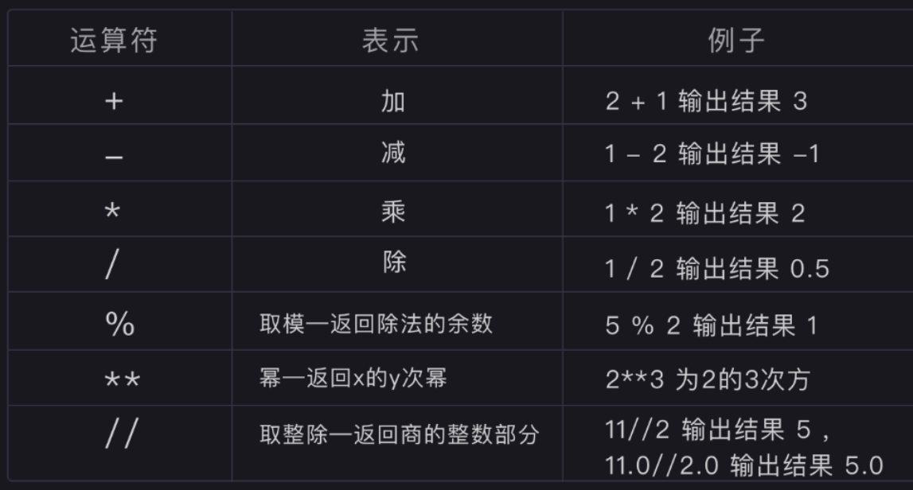

# 基本数据类型和变量

时间：`2025年10月26日`

## 1. `print()` 函数

其他内置函数详见[函数笔记](./5-函数.md)

- `print()` 函数的作用是让计算机显示参数的内容在屏幕的终端上
- `print()` 的执行流程如下：
  - 向解释器发出指令，打印 `'Hello Python'`
  - 解析器把代码解释为计算器能读懂的机器语言
  - 计算机执行完后打印结果
- **f-strings**（Formatted String Literals）
  - 目的是将变量的值优嵌入到字符串中，生成我们想要输出的内容
  - 语法：
    - 在字符串的引号前加上一个字母 `f` 或 `F`，然后将变量或表达式直接放在花括号 `{}` 中
    - 在花括号内使用冒号 `:` 以指定格式
  - 示例：

    ```python
    name = "Bob"
    age = 25

    # 直接在 {} 中放入变量名
    print(f"用户名: {name}, 年龄: {age}")
    # 输出: 用户名: Bob, 年龄: 25


    # :.2f 表示格式化为浮点数，保留两位小数
    print(f"账户余额: ${balance:.2f}") 
    # 输出: 账户余额: $1234.57 (会自动四舍五入)
    ```

---

## 2. Python 的基本数据类型

### 字符串

- 介绍：用于表示文本数据，字符串是不可变（immutable）的有序字符序列
- 语法：
  - 使用 `'`, `"`, `'''` 包裹
  - `'''` 可以跨行
  - 使用反斜杠 `\` 转义

**字符串的编码问题**

- 计算机只能处理数字，如果要处理文本，就必须先把文本转换为数字才能处理
- 最早的计算机在设计时采用 **8个比特（bit）作为一个字节（byte）**。所以，一个字节能表示的最大的整数就是255（二进制11111111 = 十进制255），0 - 255被用来表示大小写英文字母、数字和一些符号，这个编码表被称为 **ASCII编码**。比如大写字母 A 的编码是 65，小写字母 z 的编码是 122
- 如果要表示中文，显然一个字节是不够的，至少需要两个字节，而且还不能和 ASCII 编码冲突，所以，中国制定了 **GB2312 编码**，用来把中文编进去
- 类似的，日文和韩文等其他语言也有这个问题。为了统一所有文字的编码，**Unicode** 应运而生。Unicode 把所有语言都统一到一套编码里，这样就不会再有乱码问题了。
  - Unicode 通常用两个字节表示一个字符，原有的英文编码从单字节变成双字节，只需要把高字节全部填为 0 
  - 在最新的 Python 3 版本中，字符串是以 Unicode 编码的，也就是说，Python 的字符串支持多语言

### 整数

- 介绍：integer，包括正整数、负整数和零，是没有小数点的数字
- 语法
  - Python 可以处理任意大小的整数；在 Python 3 里，只有一种整数类型 int，表示为长整型，没有 python2 中的 Long
  - 算术运算符<br>

### 浮点数

- 介绍: float，是指带小数的数字
- 浮点数计算存在的“问题”：
  - 人类习惯使用十进制（base-10）计数。但在计算机内部，所有数据，包括数字，都是以二进制（base-2）的形式存储的
  - 在整数方面，任何十进制整数都可以完美地转换为二进制整数；然而在小数方面，并非所有的十进制小数都能被精确地转换成二进制小数，即，有些可以被以有限形式表述的十进制小数，如 `0.4`，无法被以有限的形式表述成二进制小数，0.4的二进制形式为 `0.011001100110011...`
  - 由于计算机的内存是有限的，它不能存储无限长的二进制小数。因此，它必须在某个位置截断，并存储一个与原始数值极其接近但不完全相等的近似值。
  - 由于精度问题，永远不要用 `==` 来比较两个经过不同计算路径得来的、你认为应该相等的浮点数

### 布尔值

- 介绍：布尔值和布尔代数的表示完全一致，一个布尔值只有 `True` 、 `False` 两种值
- 语法：
  - 可以直接用 `True`、`False` 表示布尔值（请注意大小写），也可以通过布尔运算计算出来
  - 布尔值可以用 `and`、`or` 和 `not` 运算

### 空值

- 介绍:特殊的常量 `None`，
- 语法：
  - 表示缺失或空状态： `None` 是 Python 中表示“没有值”、“空”或“未知”的唯一标准方式。它不是 `0`（数字零），也不是空字符串 `""`，也不是空列表 `[]`，它们都是有实际值的
  - 如何判断一个值是否为 None：使用 `is` 运算符，而不是 `==`

---

## 3. 基本数据类型转换

Python 中基本数据类型转换的方法有下面几个：

|方法|说明|
|-----|------|
|int(x [,base ])  |       将x转换为一个整数  |
|float(x )    |           将x转换到一个浮点数  |
|complex(real [,imag ])|  创建一个复数  |
|str(x ) |                将对象 x 转换为字符串  |
|repr(x ) |               将对象 x 转换为表达式字符串  |
|eval(str )  |            用来计算在字符串中的有效 Python 表达式,并返回一个对象  |
|tuple(s )  |             将序列 s 转换为一个元组  |
|list(s )   |             将序列 s 转换为一个列表  |
|chr(x )   |              将一个整数转换为一个字符  |
|unichr(x )  |            将一个整数转换为 Unicode 字符  |
|ord(x )     |            将一个字符转换为它的整数值  |
|hex(x )     |            将一个整数转换为一个十六进制字符串  |
|oct(x )     |            将一个整数转换为一个八进制字符串  |


可以使用 `type()` 函数来查看目标变量的类型

---

## 4. Python 中的变量

### 变量的创建和赋值

**变量的创建：**

- 在 Python 程序中，变量是用一个变量名表示，可以是任意数据类型
  - Python的变量无需声明，直接赋值创建；在Python中，不需要像在C语言或Java中那样预先声明一个变量的类型和名称。当第一次对一个变量名进行赋值操作时，Python解释器会自动创建这个变量
- **变量本身没有类型**：在Python中，变量名（如 message, count）更像一个“标签”或“引用”，它本身没有固定的类型。
- **对象才有类型**：真正拥有类型的是内存中的数据对象（例如，字符串对象 `"你好, Python!"`，整数对象 `100`）。
- 赋值就是“贴标签”：执行 count = 100 这行代码时，Python解释器做了两件事：
  - 在内存中创建一个整数对象 100。
  - 将 count 这个“标签”贴到 100 这个对象上。
  - 因为变量只是一个标签，所以它可以被撕下来，再贴到另一个完全不同类型的对象上。

**变量命名的原则**

- **硬性规定：必须遵守，否则程序会报错**
  - 变量名必须是大小写英文、数字和下划线（_）的组合
  - 不能用数字开头
  - 不能是关键字：不能使用Python的关键字（保留字）作为变量名。例如 `if`, `for`, `while`, `def`, `class` 等
- **风格建议**：推荐遵守，让代码更易读、更专业
  - **变量和函数名**：蛇形命名法 (Snake Case)
    - 所有字母小写，单词之间用下划线 `_` 连接
    - 示例：`def calculate_area(radius):`
  - **常量名**：全大写蛇形命名法 (ALL_CAPS_SNAKE_CASE)
    - 所有字母大写，单词之间用下划线 `_` 连接
    - 用于表示程序中不应被修改的常量（虽然Python语法上没有真正的常量，但这是一种强烈的信号）
    - 示例：`DEFAULT_TIMEOUT = 30`
  - **类名**：大驼峰命名法（Upper Camel Case）/ “帕斯卡命名法”（PascalCase）
    - 每个单词的首字母都大写，并且单词之间没有任何分隔符；每个单词的首字母都大写，并且单词之间没有任何分隔符
    - 示例：`class DatabaseConnection:`
  - 更多详见[PEP 8 -- Python代码风格指南](https://china-testing.github.io/python_pep8.html)

## 多个变量赋值

- Python 允许同时为多个变量赋值。例如：

    ```python
    a = b = c = 1
    ```

- 也可以为多个对象指定多个变量。例如：

    ```python
    a, b, c = 1, 2, "watermelon"
    ```
