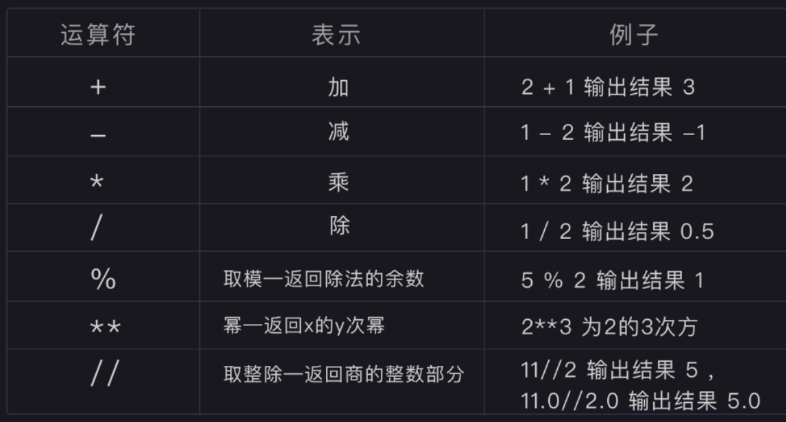

# 基本数据类型和变量

时间：`2026年9月14日`

## 1. Python 的基本数据类型

### 数据类型的分类

- **简单（基本）数据类型变量**：一个变量只装**一个值**，没有内部结构，如本节的 `int`、`float`、`bool`、`str` 等
- **复合（容器）数据类型变量**：变量是**容器**，内部装多个元素，如 `list`、`tuple`（Cf. [笔记2](./2-序列：元组&列表.md)）、`dict`、`set`（Cf. [笔记3](./3-非序列：字典&集合.md)）
- 注意"简单/复合"与"可变/不可变"是**两个独立维度**：`tuple` 复合但不可变，`list` 复合且可变；这一区分影响函数传参行为（Cf. [函数笔记](./5-函数.md)的"函数传值问题"一节）

### 字符串

#### 基本介绍

- 介绍：用于表示文本数据，字符串是不可变（immutable）的有序字符序列
- 语法：
  - 使用 `'`, `"`, `'''` 包裹
  - `"` 内的 `‘` 可不转义
  - `'''` 可以跨行
  - 使用反斜杠 `\` 转义
- 运算：
  - `+` ：字符串相加；注意，Python 不会自动转换数据类型，所以不能直接使用数字和字符串相加
  - `*` ：字符串重复
  - `in`：`x in y` 判断，如果 `x` 是 `y` 的子字符串，返回 True；否则返回 False

#### 字符串索引与切片

- **索引（Indexing）**：通过 `s[index]` 访问单个字符，索引从 `0` 开始；也支持**负数索引**，从末尾倒数（`-1` 是最后一个字符）
  - 正向索引：从第一个字符开始，0 → (len(seq) - 1)
  - 负向索引：从末尾开始，-len(seq) ← -1
- **切片（Slicing）**：通过 `s[start:end]` 截取一段子字符串
  - **左闭右开**（包含 start，不包含 end）；
  - start 和 end 都可省略：省略 start 表示从头开始，省略 end 表示取到末尾

      ```python
      s = "Python"
      print(s[1:4])   # 输出: yth
      print(s[:3])    # 输出: Pyt
      print(s[2:])    # 输出: thon
      print(s[:])     # 输出: Python（复制整个字符串）
      ```

  - **带步长的切片**：`s[start:end:step]`，step 默认为 1；step 为负数时倒着取

      ```python
      s = "Python"
      print(s[::2])    # 输出: Pto（每隔一个取一个）
      print(s[::-1])   # 逆序排列，输出为: nohtyP（反转字符串的常用技巧）
      ```

- 注意：**索引和切片都不修改原字符串**（字符串是不可变的），它们只是返回新字符串；越界索引会报 `IndexError`，但切片越界不报错，只是取到能取到的部分
- **列表使用完全相同的索引与切片语法**，详见[笔记2](./2-序列：元组&列表.md)

#### 字符串常用函数

**简单函数**

- `str(x)`：把任意对象转换为字符串
- `len(s)`：返回字符串的**字符个数**（长度）；也适用于 list、tuple、dict 等所有有长度的对象
- `ord(c)` / `chr(x)`：**互为逆运算**，在"单个字符"和它对应的 Unicode 编码（整数）之间转换
  - `ord(c)`：字符 → 编码整数（ordinal）
  - `chr(x)`：编码整数 → 字符（character）
  - Cf. [字符串的编码问题](#字符串的编码问题)：计算机存储文本的本质就是存这些编码数字

    ```python
    ord('A')      # 输出: 65（ASCII 码，见下方编码问题）
    ord('中')     # 输出: 20013（Unicode 码位）
    chr(66)       # 输出: 'B'
    chr(20013)    # 输出: '中'
    chr(ord('A') + 1)   # 输出: 'B'（常见技巧：字符"移位"）
    ```

- `hex(x)` / `oct(x)`：把整数转换为**十六进制/八进制的字符串表示**（带 `0x` / `0o` 前缀）；详细用法见下方[整数](#整数)一节的进制表示  

    ```python
    hex(255)    # 输出: '0xff'
    oct(8)      # 输出: '0o10'
    ```

- `min()` / `max()` 同样适用于**字符串**，按字符的 Unicode 编码值逐个比较：

    ```python
    print(max("hello"))   # 'o'
    print(min("hello"))   # 'e'
    print(max("Aa"))      # 'a'  ← 小写字母编码值更大（'A'=65, 'a'=97）
    ```

**常用处理方法**

- 与上面的内置函数不同，这些是**字符串的方法（method）**——用点号调用：`s.method()`；
  - 由于字符串不可变，它们都**返回新字符串（创建了一个副本），不修改原字符串**
  - 方法是“挂在类/对象上的函数”，在 Python 里它本质上就是函数对象
  - 但因为定义位置和访问方式不同，方法和函数行为上有几个关键区别：
    - 方法定义在类的内部，属于这个类；而函数不隶属于任何类
    - 二者调用方式不同

- 字符串处理方法一览
  - `s.lower()` / `s.upper()`：返回**全小写/全大写**的副本

      ```python
      s = "Hello World"
      s.lower()    # 输出: 'hello world'
      s.upper()    # 输出: 'HELLO WORLD'
      ```

  - `s.split(sep)`：按分隔符把字符串**拆成列表**（`sep` 省略时默认按任意空白拆分，i.e. 默认参数的空）

      ```python
      "a,b,c".split(",")       # 输出: ['a', 'b', 'c']
      "hello world".split()    # 输出: ['hello', 'world']
      ```

  - `s.join(iterable)`：`split` 的逆操作；用 `s` 作为连接符，把序列里的元素**拼接成一个字符串**；实际上就是将 `iterable` 的每一个元素后加一个 `s` 并输出为字符串

      ```python
      ",".join(['a', 'b', 'c'])     
      # 输出: 'a,b,c'

      " ".join(['hello', 'world'])  
      # 输出: 'hello world'

      ",".join(python)     
      # 输出: 'p,y,t,h,o,n'
      # 重点注意这个
      ```

  - `s.count(sub)`：统计子字符串 `sub` 出现的**次数**，返回整数

      ```python
      "banana".count("an")    # 输出: 2
      ```

  - `s.replace(old, new)`：把所有 `old` 子串**替换**为 `new`，返回新字符串

      ```python
      "Hello World".replace("World", "Python")   
      # 输出: 'Hello Python'
      ```

  - `s.strip(chars)`：**剥掉两端**指定的字符（`chars` 省略时默认剥掉空白：空格、`\n`、`\t` 等）；只剥两端，中间的不动；常用于清理 `input()` 读入的数据

      ```python
      "  hi  ".strip()        # 输出: 'hi'
      "xxhixx".strip("x")     # 输出: 'hi'
      ```

  - `s.center(width, fillchar)`：返回居中对齐的字符串，总宽度为 `width`（省略时默认使用空白填充，i.e. 默认参数的空）

      ```python
      "hi".center(10)    # 输出: '    hi    '（左右各补 4 个空格）
      "hi".center(10, "*")   # 输出: '****hi****'（指定填充字符）
      ```

  - `s.capitalize()`：返回**首字母大写、其余全部小写**的副本
    - 注意与 `s.title()` 区分：`title()` 是每个单词首字母大写

      ```python
      "hello world".capitalize()   # 输出: 'Hello world'（只有 H 大写，w 保持小写）
      "hELLO wORLD".capitalize()   # 输出: 'Hello world'（其余字母被强制转小写）
      "hello world".title()        # 输出: 'Hello World'（对比：每个单词首字母大写）
      ```

  - `s.startswith(prefix)` / `s.endswith(suffix)`：判断是否以 `prefix`/`suffix` **开头/结尾**，返回布尔值
    - 常用作推导式、`if` 里的筛选条件（Cf. [笔记6](./6-推导式、迭代器和生成器.md) 表示例2）
    - 可传**元组**表示"以其中任意一个开头/结尾"：`s.startswith(('p', 'P'))`

      ```python
      "Python".startswith("Py")     # 输出: True
      "image.png".endswith(".png")  # 输出: True
      ```

  - `s.isdigit()` / `s.isalpha()` / `s.isalnum()`：判断字符串是否**全为数字 / 全为字母 / 全为字母或数字**，返回布尔值；同类还有 `s.isupper()` / `s.islower()`（是否全大写/全小写）

      ```python
      "123".isdigit()    # 输出: True
      "abc".isalpha()    # 输出: True
      "ab12".isalnum()   # 输出: True
      "ab 12".isalnum()  # 输出: False（含空格）
      ```

  - `s.find(sub)` / `s.index(sub)`：查找子字符串 `sub` **第一次出现的位置**（索引）
    - 找不到时行为不同：**`find` 返回 `-1`，`index` 直接报 `ValueError`**
    - 不确定子串一定存在时用 `find`（安全，常配合 `if s.find(x) != -1` 或直接 `if x in s` 判断）；确信存在、找不到就该出错时用 `index`
    - 两者都支持 `s.find(sub, start, end)` 限定查找范围

      ```python
      "banana".find("nan")     # 输出: 2（b=0, a=1, n=2，从索引 2 开始匹配）
      "banana".find("cat")     # 输出: -1（不报错）

      "banana".index("nan")    # 输出: 2
      "banana".index("cat")    # 报错: ValueError: substring not found
      ```

- **方法链（链式调用）**：把多个方法连续写下去，形如 `对象.方法1(参数).方法2(参数)`；`.` 从左向右结合，在前一个方法的**返回值**身上接着调用后一个方法
  - 链条能否继续，取决于**上一个方法返回了什么**
    - 字符串方法（`replace`、`strip`、`lower`、`upper` 等）都**返回新的字符串**，返回值身上仍有字符串方法，所以可以一路接下去
    - 若某个方法**返回 `None`**，链条立即断裂。列表的原地方法正是如此：`list.sort()`、`list.append()`、`list.reverse()` 返回 `None`（Cf. [笔记2](./2-序列：元组&列表.md)）
  - 长链条可以借助括号换行，`pandas` 中常见这种写法：

      ```python
      result = (s.strip()
                 .lower()
                 .replace("world", "python"))
      ```

#### f-string 格式化

- **f-string（Formatted String Literals，格式化字符串字面量）** 是一种字符串格式化方式；目的就是把变量或表达式的值直接嵌入字符串，生成我们想要的输出
- 语法：
  - 在字符串的引号前加上一个字母 `f` 或 `F`，然后把变量或表达式直接放进花括号 `{}` 中；
  - `{}` 中能放的内容：
    - **变量名**：如 `{name}`
    - **任意表达式**：运算（`{age + 1}`）、函数调用（`{name.upper()}`）
    - 在花括号内使用冒号 `:` 以指定格式，即 `{<表达式>/<变量名>:<格式控制标记>}`；格式控制标记的写法与**下一节 [`format` 格式化](#format-格式化) 完全一致**
- **转义**：需要输出字面意义的 `{` 或 `}` 时，写成 `{{`、`}}`

    ```python
    name = "Bob"
    age = 25

    # 直接嵌入变量
    print(f"用户名: {name}, 年龄: {age}")       # 输出: 用户名: Bob, 年龄: 25

    # {} 内可以是表达式（运算 / 函数调用）
    print(f"明年你 {age + 1} 岁")               # 输出: 明年你 26 岁
    print(f"名字大写: {name.upper()}")          # 输出: 名字大写: BOB

    # 冒号后是格式控制标记（保留两位小数，自动四舍五入）
    balance = 1234.567
    print(f"账户余额: ${balance:.2f}")          # 输出: 账户余额: $1234.57

    # 用 {{ 和 }} 输出字面花括号
    print(f"{{1 + 1}}")                         # 输出: {1 + 1}（不是 2）
    ```

#### `format` 格式化

- 介绍：`format` 是**字符串的方法**，用于把变量的值填入字符串模板中。
- **与 f-string 相比**：
  - **填值方式不同**：f-string 直接在 `{}` 里写变量或表达式；`format` 把值放在方法参数里，模板与参数分离
  - **简洁性与性能**：f-string 写法更直观；且编译期即完成解析，性能略优
  - **历史（发布时间）**：`format()` 随 **PEP 3101** 于 **2008 年发布的 Python 3.0** 引入（同时移植到 Python 2.6）；f-string 则是 **2016 年发布的 Python 3.6**（PEP 498）才加入 
- 语法：`"模板字符串".format(参数列表)`，模板中的 `{}` 是占位符
  - **占位符的三种写法**
    - `{}`：按顺序填入参数（位置参数）
    - `{0}`、`{1}` 等：显式指定填入第几个参数；同一个序号可重复使用
    - `{name}`：按关键字参数名填入（关键字参数）
  - 占位符可以嵌套，如：`print("{0:{1}^25}".format(s, y))`

    ```python
    "{} 和 {}".format("Python", "Java")        # 输出: Python 和 Java
    "{1} 是 {0}".format("Python", "Java")      # 输出: Java 是 Python（按序号取）
    "{0} {0}".format("hi")                     # 输出: hi hi（参数可重复引用）

    "{name} 今年 {age} 岁".format(name="Bob", age=25)
    # 输出: Bob 今年 25 岁
    ```

- **格式控制标记**：
  - 在占位符中加冒号，格式为 `{<参数序号>:<格式控制标记>}`
    - 注意：f-string 格式控制标记与 format 格式控制标记完全一致
  - 格式控制标记按顺序由以下几个部分组成（均可省略，省略时用默认值）：

    |组成部分|含义|默认值|
    |--------|----|----|
    |`<填充>`|填充字符（必须是单个字符），**仅与对齐结合使用** |空格|
    |`<对齐>`|`<` 左对齐；`>` 右对齐；`^` 居中|数字默认 `>`，字符串默认 `<`|
    |`<宽度>`|输出内容的总宽度，不足时用填充字符补足|内容本身宽度|
    |`,`| 显示数字的千位分隔符 |无|
    |`.精度`| 浮点数的小数位数；对字符串则是最大输出长度 |无|
    |`<类型>`| `b`/`o`/`d`/`x`：二进制/八进制/十进制/十六进制整数；<br> `e`/`f`/`%`：科学计数法/小数形式/百分数 |依数值类型而定|

    ```python
    # 填充 + 对齐 + 宽度：内容占 10 格，其余用 * 填充
    "{:*^10}".format("hi")     # 输出: ****hi****（居中）
    "{:*<10}".format("hi")     # 输出: hi********（左对齐）
    "{:*>10}".format("hi")     # 输出: ********hi（右对齐）

    # 千位分隔符
    "{:,}".format(1234567)     # 输出: 1,234,567

    # 精度：浮点数保留小数位，字符串截取长度
    "{:.2f}".format(3.14159)   # 输出: 3.14
    "{:.3}".format("Python")   # 输出: Pyt

    # 类型（进制转换，效果类似 bin()/oct()/hex() 但没有前缀）
    "{:b}".format(10)          # 输出: 1010（二进制）
    "{:x}".format(255)         # 输出: ff（十六进制）
    "{:.1%}".format(0.125)     # 输出: 12.5%（百分数）

    print("账户余额: ${:.2f}".format(1234.567))
    # 输出: 账户余额: $1234.57（自动四舍五入）
    ```

#### 字符串的编码问题

- 计算机只能处理数字，如果要处理文本，就必须先把文本转换为数字才能处理
- 最早的计算机在设计时采用 **8个比特（bit）作为一个字节（byte）**。所以，一个字节能表示的最大的整数就是255（二进制11111111 = 十进制255）；0 - 255 被用来表示大小写英文字母、数字和一些符号，这个编码表被称为 **ASCII编码**
  - **大写字母 A 的编码是 65，小写字母 z 的编码是 122**
- 如果要表示中文，显然一个字节是不够的，至少需要两个字节，而且还不能和 ASCII 编码冲突，所以，中国制定了 **GB2312 编码**，用来把中文编进去
- 类似的，日文和韩文等其他语言也有这个问题。为了统一所有文字的编码，**Unicode** 应运而生。Unicode 把所有语言都统一到一套编码里，这样就不会再有乱码问题了。
  - Unicode 通常用两个字节表示一个字符，原有的英文编码从单字节变成双字节，只需要把高字节全部填为 0 
  - 在最新的 Python 3 版本中，字符串是以 Unicode 编码的，也就是说，Python 的字符串支持多语言

### 整数

- 介绍：integer，包括正整数、负整数和零，是没有小数点的数字
- 语法
  - Python 可以处理任意大小的整数；在 Python 3 里，只有一种整数类型 int，表示为长整型，没有 python2 中的 Long
  - 算术运算符/“数值运算操作符”<br>（注意：算术运算符实际上有 9 个，但是有两个是近乎重复的）

**整数的不同进制表示**

- Python 中的整数默认用十进制表示，同时也支持二进制、八进制、十六进制三种书写方式：
  - 二进制：以 `0b` 或 `0B` 开头（Binary），例如 `0b1010` 表示十进制的 10
  - 八进制：以 `0o` 或 `0O` 开头（Octal/ October/ Octopus），例如 `0o12` 表示十进制的 10
  - 十六进制：以 `0x` 或 `0X` 开头（H**ex**adecimal），例如 `0xA` 表示十进制的 10
- 进制转换：
  - `bin(x)` / `oct(x)` / `hex(x)`：把整数转换成对应的二进制、八进制、十六进制字符串（返回结果带 `0b` / `0o` / `0x` 前缀）
  - `int('1010', 2)`：**通过第二个参数 `base` 指定进制**，把字符串按该进制转回十进制整数
- 输出：直接 `print(0B1011)`，自动转换成十进制数输出

### 浮点数

- 介绍: float，是指带小数的数字
- **浮点数计算存在的“问题”：**
  - 人类习惯使用十进制（base-10）计数。但在计算机内部，所有数据，包括数字，都是以二进制（base-2）的形式存储的
  - 在整数方面，任何十进制整数都可以完美地转换为二进制整数；然而在小数方面，并非所有的十进制小数都能被精确地转换成二进制小数，即，有些可以被以有限形式表述的十进制小数，如 `0.4`，无法被以有限的形式表述成二进制小数，0.4的二进制形式为 `0.011001100110011...`
  - 由于计算机的内存是有限的，它不能存储无限长的二进制小数。因此，它必须在某个位置截断，并存储一个与原始数值极其接近但不完全相等的近似值。
  - 由于精度问题，永远不要用 `==` 来比较两个经过不同计算路径得来的、你认为应该相等的浮点数
- **科学计数法**：Python 浮点数可以用科学计数法表示，用字母 `e` 或 `E` 表示“乘以 10 的多少次方”
  - 例如 `1.5e3` 表示 `1.5 × 10^3 = 1500.0`，`2.5e-2` 表示 `2.5 × 10^-2 = 0.025`
  - `e` 后面的数字就是 10 的指数：正数小数点向右移，负数小数点向左移

### 复数

- 介绍：complex，由实部（real）和虚部（imaginary）组成，虚部用 `j` 或 `J` 表示
- 语法：
  - 用 `a + bj` 的形式创建，其中 `a` 是实部，`b` 是虚部，例如 `3 + 4j`
  - 也可以用 `complex(real, imag)` 创建，例如 `complex(3, 4)`
  - 访问实部与虚部：`z.real` 获取实部，`z.imag` 获取虚部（注意这里和数学上是一致的，虚部是一个实数）
  - 直接输出一个复数，结果会使用括号包裹，如`(9 + 2J)`
- 示例：

    ```python
    z = 3 + 4j
    print(z.real)  # 输出: 3.0
    print(z.imag)  # 输出: 4.0；注意这里输出的结果是一个浮点数！
    ```

### 布尔值

- 介绍：布尔值和布尔代数的表示完全一致，一个布尔值只有 `True` 、 `False` 两种值
- 语法：
  - 可以直接用 `True`、`False` 表示布尔值（请注意大小写，**必须大写！小写的不是布尔值！**），也可以通过布尔运算计算出来
  - 布尔值可以用 `and`、`or` 和 `not` 运算

### 空值

- 介绍：特殊的常量 `None`
- 语法：
  - 表示缺失或空状态： `None` 是 Python 中表示“没有值”、“空”或“未知”的唯一标准方式。它不是 `0`（数字零），也不是空字符串 `""`，也不是空列表 `[]`，它们都是有实际值的
  - 如何判断一个值是否为 None：使用 `is` 运算符，而不是 `==`

---

## 2. 基本数据类型转换

Python 中基本数据类型转换的方法有下面几个：

|方法|说明|
|-----|------|
|int(x [,base ])  |       将x转换为一个整数；如果是小数转换过来的则直接取整  |
|float(x)    |           将x转换到一个浮点数  |
|complex(real [,imag ])|  创建一个复数  |
|str(x) |                将对象 x 转换为字符串  |
|tuple(s)  |             将序列 s 转换为一个元组  |
|list(s)   |             将序列 s 转换为一个列表  |
|chr(x)   |              将一个整数转换为一个字符  |
|unichr(x)  |            将一个整数转换为 Unicode 字符  |
|ord(x)     |            将一个字符转换为它的整数值  |
|hex(x)     |            将一个整数转换为一个十六进制字符串  |
|oct(x)     |            将一个整数转换为一个八进制字符串  |


可以使用 `type()` 函数来查看目标变量的类型

---

## 3. Python 中的变量

### 变量的创建和赋值

- 在 Python 程序中，变量是用一个变量名表示，可以是任意数据类型
  - Python的变量无需声明，直接赋值创建
  - 在Python中，不需要像在C语言或Java中那样预先声明一个变量的类型和名称。当第一次对一个变量名进行赋值操作时，Python解释器会自动创建这个变量
- 变量的类型
  - **变量本身没有类型**：在Python中，变量名（如 message, count）更像一个“标签”或“引用”，它本身没有固定的类型。
  - **对象才有类型**：真正拥有类型的是内存中的数据对象（例如，字符串对象 `"你好, Python!"`，整数对象 `100`）。
- **赋值就是“贴标签”**：执行 count = 100 这行代码时，Python 解释器做了两件事：
  - 在内存中创建一个整数对象 100。
  - 将 count 这个“标签”贴到 100 这个对象上。
  - **因为变量只是一个标签，所以它可以被撕下来，再贴到另一个完全不同类型的对象上**。

### 变量比较：`is` 与 `==`

- 变量是“标签”，比较两个变量时存在两个不同层次的问题：**是否指向同一个对象**（身份）与**值是否相等**
- `==`：比较**值**是否相等，内部调用对象的 `__eq__` 方法；如 `1 == 1.0` 为 `True`，`[1, 2] == [1, 2]` 为 `True`
- `is`：比较**身份**，判断两个变量是否指向内存中的同一个对象，等价于 `id(a) == id(b)`（`id()` 的介绍见[笔记5A1](./5A1-重要内置函数介绍.md)）
- 使用约定：
  - 比较值用 `==`；与 `None`、`True`、`False` 等**单例**比较用 `is`（见上文“空值”一节）
  - 不要用 `is` 比较数字、字符串的值：小整数（-5 至 256）会被缓存，短字符串会被驻留（interning），`256 is 256` 这类写法看似成立，结果实际依赖解释器实现

    ```python
    a = [1, 2, 3]
    b = a
    c = [1, 2, 3]

    a == b      # True，值相等
    a is b      # True，同一个对象
    a == c      # True，值相等
    a is c      # False，值相等但身份不同（引用语义见笔记2）

    x = None
    x is None   # True，判断 None 的推荐写法

    p = 256
    q = 256
    p is q      # True，小整数缓存所致，属于实现细节
    ```

### 特殊操作

**赋值运算符/“增强赋值操作符”**

- 8 个；`=`，`+=`，`-=`，`*=`，`/=`，`%=`，`**=`，`//=` ；
- `x ※= y` $\leftrightarrow$ `x = x ※ y`

**多个变量赋值**

- Python 允许同时为多个变量赋值。例如：

    ```python
    a = b = c = 1
    ```

- 也可以为多个对象指定多个变量。例如：

    ```python
    a, b, c = 1, 2, "watermelon"
    ```

**交换变量**

- 可以通过如下语法快速交换变量的值：

    ```python
    a, b = b, a
    ```

### 标识符及其命名原则

#### 标识符（Identifier）介绍

- 介绍：**标识符是给变量、函数、类、模块等对象命名时使用的名字** = 变量名、函数名、类名都属于标识符
- 变量名只是标识符的一种，标识符还包括函数名、类名、模块名等
- 标识符的命名需要遵循下面的“命名原则”

### <mark style="background-color: #333; color: #fef08a;">标识符命名原则</mark>

- **硬性规定：必须遵守，否则程序会报错**
  - 变量名必须是大小写英文、数字和下划线（`_`）的组合
  - 不能用数字开头，但可以是下划线开头
  - 不能使用符号
  - 大小写敏感
  - 不能是关键字/保留字：不能使用Python的关键字（保留字）作为变量名。例如 `if`, `for`, `while`, `def`, `class` 等
- **风格建议：推荐遵守，让代码更易读、更专业**
  - **变量和函数名**：***蛇形命名法 (Snake Case)***
    - 所有字母小写，单词之间用下划线 `_` 连接
    - 示例：`def calculate_area(radius):`
  - **常量名**：***全大写蛇形命名法 (ALL_CAPS_SNAKE_CASE)***
    - 所有字母大写，单词之间用下划线 `_` 连接
    - 用于表示程序中不应被修改的常量（虽然**Python语法上没有真正的常量**，但这是一种强烈的信号）
    - 示例：`DEFAULT_TIMEOUT = 30`
  - **类名**：***大驼峰命名法（Upper Camel Case）/ “帕斯卡命名法”（PascalCase）***
    - 每个单词的首字母都大写，并且单词之间没有任何分隔符；
    - 示例：`class DatabaseConnection:`
  - 更多详见[PEP 8 -- Python代码风格指南](https://china-testing.github.io/python_pep8.html)

