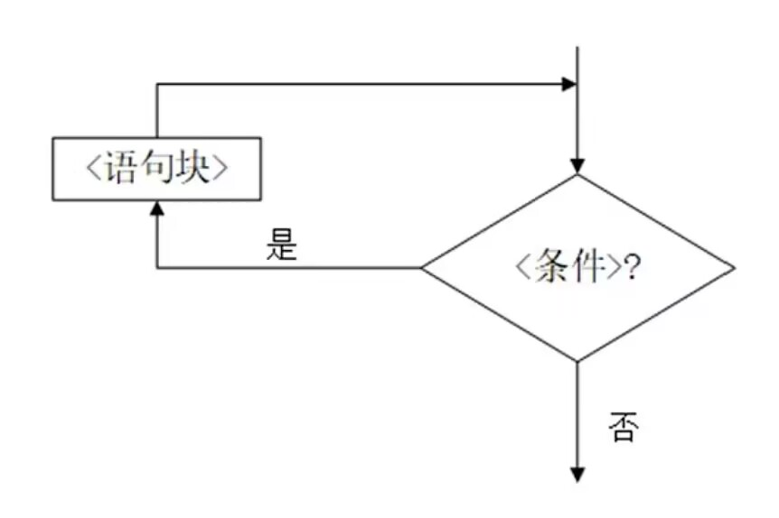

# 条件语句与循环语句

时间：`2026年9月9日`

## 1. 条件语句

- Python 条件语句跟其他语言基本一致的，都是**通过一条或多条语句的执行结果（ True 或者 False ）来决定执行的代码块**。
- Python 程序语言指定：
  - 任何非 0 和非空（null）值为 `True`
  - 0 或者 null 为 `False`

### 基础语法

```python
if 判断条件：
    执行语句
else：
    执行语句
```

- **`if` 和 `else` 后一定能要有冒号 `:`**
- 要有缩进，**缩进是语法组成（参见[笔记4A](./4A-冒号、缩进和语句顺序.md)）**，没有缩进会报错

**示例：**

```python
num = 6
if num :
    print('Hello Python')
else:
    print('fail!')
```

### 复杂情况

**多个判断条件：** 使用 `elif`

```python
if 判断条件1:
    执行语句1
elif 判断条件2:
    执行语句2
elif 判断条件3:
    执行语句3
else:
    执行语句4
```

- 能够执行 `执行语句2` 的情况一定是 `判断条件1` 不满足了

**多个条件同时判断**：

- 使用逻辑连接词
- 注意括号的使用

```python
if java > 80 and python > 80:
    print('优秀')
else :
    print('不优秀')

if ( java >= 80 and java < 90 ) or ( python >= 80 and python < 90):
    print('良好')
```

**if 嵌套**：不太建议使用，不便于阅读

```python
if java > 80:
    if python > 80:
        print('goooood!')
    else:
        print('bad')
else:
    print('bad')
```

### 三元表达式（条件表达式）

- if-else 的**单行简化写法**，用于"二选一地得到一个值"。它不是语句（statement），而是**表达式（expression）**，可以直接放在赋值号右边、函数参数里
- 语法：**先写结果，条件夹在中间**

    ```python
    结果A if 判断条件 else 结果B
    ```

- **阅读顺序特殊**：先看中间的条件，条件为真取左边的结果 A，为假取右边的结果 B

**与普通 if-else 的对比：**

```python
# 普通 if-else 语句
if score >= 60:
    result = '及格'
else:
    result = '不及格'

# 三元表达式：一行完成
result = '及格' if score >= 60 else '不及格'
```

- **只计算被选中的那个分支**（和逻辑连接词的短路求值同理）：

    ```python
    x = f() if condition else g()   # condition 为真时，g() 不会被调用
    ```

---

## 2. 循环语句

- 目的：让计算机执行重复的工作
- **构成：循环语句（for + while）+ 控制语句**
- 分类（NCRE 2）：
  - “遍历循环”：for
  - “无限循环”/ “条件循环”：while

### 循环语句

#### for 循环

**for 循环语法**

```python
for iterating_var in sequence:
# for 循环变量 in 可迭代对象:
# 循环变量随便写，一般用 i、j、k 等小写字母表示
   statements(s) # 循环体
```

- 整数和浮点数不可以直接放在 for 循环的可迭代对象位置
- 整数在 for 循环需要搭配 **`range()` 函数**使用；`range()` 函数将
  - 使用 range(x) 函数，就可以生成一个从 0 到 x-1 的整数序列（即，左闭右开）；
    - `range(3)` = `range(0,3)`
  - **完整形式**：`range(起始,终止,步长)`；使用 range() 函数，更多是为了把一段代码重复运行 n 次
  - 示例：

      ```python
      for i in range(0,10,2):
          print(i)
      ```

**for 循环使用多个循环变量接收多个值**

- **本质是「序列解包（元组解包）」**：for 每一轮取出的元素本身是一个可迭代对象（通常是元组/列表），Python 会自动把它按位置依次赋给多个循环变量
- 语法：`for var1, var2 in sequence:`，要求 `sequence` 的**每个元素**都能解包出**恰好相同个数**的值，否则报 `ValueError`

    ```python
    # 每个元素是元组 (姓名, 年龄)
    students = [("张三", 20), ("李四", 22), ("王五", 21)]

    for name, age in students:
        print(f"{name} 今年 {age} 岁")
    # 第一轮：name="张三", age=20
    ```

- **数量不匹配会报错**：

    ```python
    for a, b in [(1, 2, 3)]:   # ValueError: too many values to unpack
        pass

    for a, b, c in [(1, 2)]:   # ValueError: not enough values to unpack
        pass
    ```

- **`enumerate()` 函数**：同时拿到「索引 + 元素」

    ```python
    for i, value in enumerate(["a", "b", "c"]):
        print(i, value)   # 0 a / 1 b / 2 c
    # enumerate 每轮产出的就是元组 (索引, 元素)
    ```

- **`zip()` 函数**：并行遍历多个序列

    ```python
    names = ["张三", "李四"]
    scores = [90, 85]

    for name, score in zip(names, scores):
        print(name, score)
    # zip 把多个序列按位置"打包"成元组 (name, score)
    ```

- 只需要部分值时：用 `_` 占位丢弃，或用 `*` 收集多余值

    ```python
    for _, age in students:        # 不关心姓名
        print(age)

    for first, *rest in [(1, 2, 3), (4, 5, 6)]:
        print(first, rest)         # 1 [2, 3] / 4 [5, 6]
    ```

#### while 循环



```python
while 条件语句为 true:
    statements(s)
```

**for 循环和 while 循环的区别**：

- for 循环主要用在迭代可迭代对象的情况
- while 循环主要用在需要满足一定条件为真，反复执行的情况
- **部分情况下**，for 循环和 while 循环可以互换使用

#### 嵌套循环

循环语句和条件语句一样，是可以嵌套的

- for 循环嵌套语法

    ```python
    for iterating_var in sequence:
        for iterating_var in sequence:
            statements(s)
        statements(s)
    ```

- while 循环嵌套语法

    ```python
    while expression:
        while expression:
            statement(s)
        statement(s)
    ```

- 除此之外，也可以在 while 循环中嵌入 for 循环，反之，在 for 循环中嵌入 while 循环

---

### 控制语句

#### break

- `break` 用于**立即、完全地终止当前所在的循环**，程序将**跳出整个循环体**，继续执行循环后面的代码
  - 当你已经达到了循环的目的，或者某个条件满足后不再需要继续循环时，就可以使用 `break`
- 示例：找到第一个偶数后直接退出

    ```python
    for num in numbers:
        print(f"当前为：{num}")

        if num % 2 == 0:
            print(f"找到偶数，为：{num}")
            break

    print('结束循环')
    ```

#### for ... else/ while ... else

- 循环体中的 else 子句，**仅在循环正常、完整地执行完毕（即没有被 break 语句中途打断）的情况下**，才会执行
  - 可以理解为 *"for/while... (if no break), then..."*。
  - 这非常适合用来处理“在整个循环中都没有找到目标”的场景
- 示例：

    ```python
    value_to_find = 5

    for item in my_list:
        print(f"检查 {item}...")
        if item == value_to_find:
            print(f"找到了值: {item}")
            break  # 循环在这里被中断
    else:
        # 因为循环被 break 了，所以这个 else 块会被跳过
        print(f"列表中没有找到值: {value_to_find}")
    ```

#### continue

- `continue` 用于跳过本次循环中尚未执行的代码，直接开始下一次循环。它并不会终止整个循环，只是提前结束当前这一轮。
  - 当循环中的某个特定项（即该次循环）不符合处理条件，你希望忽略它并继续处理下一个项时
  - 无论 `continue` 后有多少的语句，遇到 `continue` 被执行的情况，这些语句都不会被执行
- 示例：忽略所有偶数

    ```python
    for num in numberds:
        if num % 2 == 0:
            continue # 跳过本次循环的剩余部分(print语句)，直接进入下一次循环

        print(f"奇数：{num}")

    print('Finish')
    ```

---

### 空操作语句：pass

- `pass` 是一个空操作语句（不是控制语句），它什么也不做，仅仅起到一个占位符的作用，以保持程序结构的完整性
  - 在你构思代码结构，但尚未想好具体实现时，可以用 pass 填充函数体、类定义、if 分支等，以确保代码在语法上是正确的，可以正常运行
- 示例：

    ```python
    for i in range(3):
        if i == 1:
            pass  # 此处暂不处理，可保留为未来添加逻辑的位置
        print(i)
    ```
