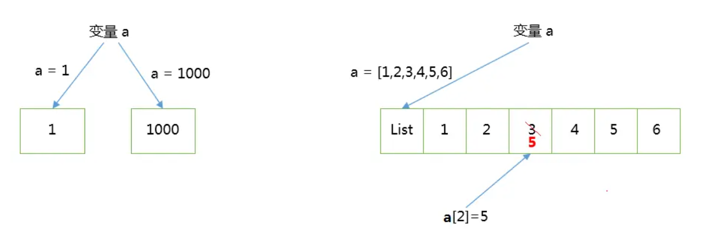

# 函数

时间：`2025年10月13日`

## 1. 基本介绍及语法

### Def. of functions

- **函数就是组织好的，可重复使用的，用来实现单一，或相关联功能的代码段**。
  - 目的：方便使用
- 函数的本质就是我们把一些数据喂给函数，让他内部消化，然后吐出你想要的东西（Cf. [5A-函数与函数主义](./5A-函数与函数主义.md)）

### 自定义函数的组成部分

- 前面就调用过一些内置的函数，如 `print()`；而现在需要了解的是 **自定义函数**
- **<a id="func_grammar">自定义函数的语法：</a>**

  ```python
  def 函数名(参数1，参数2....参数n):
      函数体
      return 语句
  ```

  - 开头：
    - 函数代码块以 `def` 关键词开头，后接 `函数标识符名称` 和 `圆括号()`
    - 任何传入参数和自变量必须放在圆括号中间。<mark>圆括号之间可以用于定义参数</mark>
  - 函数体：
    - 函数的第一行语句可以选择性地使用<mark>文档字符串（用于存放函数说明）</mark>
    - 函数内容以冒号起始，并且缩进
  - 返回值：
    - `return [表达式]` 结束函数，**选择性地返回一个值给调用方。不带表达式的 return 相当于返回 None**。
    - 函数也可以返回多个值

- **示例：**

  ```python
  # -*- coding: UTF-8 -*-

  def  division ( num1, num2 ):
    # 求商与余数
          a = num1 % num2
          b = (num1-a) / num2
          return b , a

  num1 , num2 = division(9,4)
  tuple1 = division(9,4)

  print (num1,num2)
  print (tuple1)
  ```

  - 尽管第一个输出值返回了多个值，实际上是先创建了一个元组然后返回的
    - 元组是可以直接用逗号来创建的
  - Python 语言中的函数返回值可以是多个，而其他语言都不行，这是Python 相比其他语言的简便和灵活之处
  - Python 一次接受多个返回值的数据类型就是元组

---

## 2. 函数的参数

### Overview

- 设置与传递参数是函数的重点，而 Python 的函数对参数的支持非常的灵活。
- 主要的参数类型有：默认参数、关键字参数（位置参数）、不定长参数。

### 默认参数

**Theory**

- 如果调用函数时，某参数没有传参，但需要默认值，这时候就需要用到默认参数
- 语法：在构造函数参数时，给参数赋值
- 注意：
  - 只有在<mark>形参表</mark>末尾的那些参数可以有默认参数值；也就是说，不能在声明函数形参的时候，先声明有默认值的形参，而后声明没有默认值的形参。
  - **默认参数的值是不可变的对象**，比如，None、True、False、数字或字符串
    - 如果将默认参数值定义为可改变的对象，当默认值在其他地方被修改后，将会遇到各种麻烦
    - 因此，如果参数中是一个可修改的容器，如列表，那么默认值要写成 `a = None`，而不是 `a = []`

**示例：**

```python
def print_user_info( name , age , sex = '男' ):
  函数体
```

### 关键字参数（位置参数）

**Theory**

- 一般情况下，需要给函数传参的时候，是要按顺序来的，如果不对应顺序，就会传错值
- 在 Python 中，可以通过参数名来给函数传递参数，而不用关心参数列表定义时的顺序，这被称之为关键字参数

**示例：**

```python
# 默认的情况
print_user_info( '苏苏' , 18 , '女')
# 关键字参数
print_user_info( name = '苏苏' ,sex = '女', age = 18 )
```

### 不定长参数

**Theory**

- 有些时候，在设计函数时，我们无法确定传入的参数个数，这是就需要使用使用不定长参数
- Python 提供了一种元组的方式来接受没有直接定义的参数。使用方式是：在参数前加星号 `*`
  - 如果在函数调用时没有指定参数，它就是一个空元组

**示例：**

```python
def print_user_info( name ,  age  , sex = '男' , * hobby):
  函数体

print_user_info( '苏苏' ,18 , '女', '打羽毛球','游泳')
```

#### 强制使用关键字参数

- 关键字参数使用简单，不容易参数出错；因此，有些时候，我们定义的函数希望某些参数强制使用关键字参数传递
- 将强制关键字参数放到某个 `*` 参数或者单个 `*` 后面就能达到这种效果

**示例：**

```python
def print_user_info( name , *, age  , sex = '男' ):
  函数体
```

---

## 3. 函数传值问题

函数参数的传递中，传递的是类型对象，而这些类型对象可以分为可更改类型和不可更改的类型

- 在 Python 中，**字符串，整形，浮点型，tuple** 是不可更改的对象，而 **list，dict** 等是可以更改的对象。
  - **不可更改的类型**：变量赋值 `a = 1`，其实就是生成一个整形对象 1 ，然后变量 a 指向 1，当 `a = 1000` 其实就是再生成一个整形对象 1000，然后改变 a 的指向，不再指向整形对象 1 ，而是指向 1000，最后 1 会被丢弃
  - **可更改的类型**：变量赋值 `a = [1,2,3,4,5,6]` ，就是生成一个对象 list，list 里面有 6 个元素，而变量 a 指向 list ，`a[2] = 5`则是将 list a 的第三个元素值更改,这里跟上面是不同的，并不是将 a 重新指向，而是直接修改 list 中的元素值。<br>
- 这也影响到函数中参数的传递
  - **不可更改的类型**：类似 *c++ 的值传递*，如 整数、字符串、元组。如 `func（a）`，**传递的只是 a 的值，没有影响 a 对象本身**。比如在 `func（a）` 内部修改 a 的值，只是修改另一个复制的对象，不会影响 a 本身。
  - **可更改的类型**：类似 *c++ 的引用传递*，如 列表，字典。如 `func（a）`，则是**将 a 真正的传过去，修改后 func 外部的 a 也会受影响**

---

## 4. 匿名函数

**Theory**

- 应用场景：定义一个很短的<mark>回调函数</mark>，且不想用 `def` 的形式去写一个长的函数
- 使用 `lambda` 来创建匿名函数，即不再使用 def 语句这样标准的形式定义一个函数
- 匿名函数主要有以下特点：
  - lambda 只是一个表达式，函数体比 def 简单很多。
  - lambda 的主体是一个表达式，而不是一个代码块。仅仅能在 lambda 表达式中封装有限的逻辑进去。
  - lambda 函数拥有自己的命名空间，且不能访问自有参数列表之外或全局命名空间里的参数。
- 基本语法：`lambda [arg1 [,arg2,.....argn]]:expression`

**示例：**

```python
sum = lambda num1 , num2 : num1 + num2;
print( sum( 1 , 2 ) )
```

注意：

- 尽管 lambda 表达式允许你定义简单函数，但是它的使用是有限制的。 你只能指定单个表达式，它的值就是最后的返回值。也就是说，不能包含其他的语言特性，包括多个语句、条件表达式、迭代以及异常处理等等。
- lambda 表达式中的变量是自由变量，在运行时才绑定值，而不是定义时就绑定
