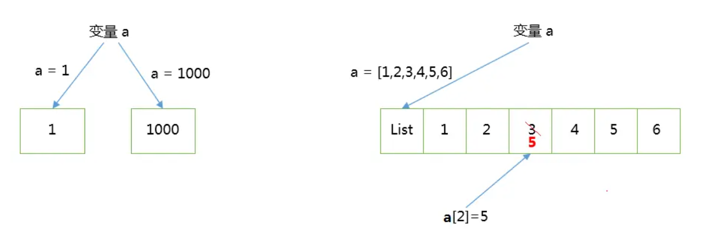

# 函数

时间：`2026年8月1日`

## 1. 基本介绍及语法

### Def. of functions

- **函数就是组织好的，可重复使用的，用来实现单一，或相关联功能的代码段**。
  - 目的：降低编程难度、增加代码复用
  - 函数的本质就是我们把一些数据喂给函数，让他内部消化，然后吐出你想要的东西（Cf. [5A-函数与函数主义](./5A-函数与函数主义.md)）
- **函数调用的两个核心组成部分**
  - **函数名 (Function Name)**：它**是一个标识符**，告诉Python我们想要执行哪一段预先定义好的代码
  - **参数 (Arguments)**：“指令的执行对象”；它们**是传递给函数的数据**，供函数内部的代码使用。参数必须放在函数名后面的圆括号 `()` 里
- 函数的分类
  1. 内置函数
  2. 自定义函数
  3. 方法
  4. 匿名函数
  5. 其他类型的函数：生成器函数等等
- **内置函数（Built-in Functions）** 是Python解释器自带的一组核心函数。它们是Python语言的基础工具箱，**无需导入任何模块，就可以在任何Python代码中直接使用**。
  - Python 3 中大约有70个内置函数；
  - *使用 `dir(__builtins__)` 来获取完整的内置函数列表*

### 自定义函数的组成部分（概要）

- **<a id="func_grammar">自定义函数的语法：</a>**

  ```python
  def 函数名(参数1，参数2....参数n):
      函数体
      return 语句
  ```

  - 开头：
    - 函数代码块以 `def` 关键词开头，后接 `函数标识符名称` 和 `圆括号()`
    - 任何传入参数和自变量必须放在圆括号中间。圆括号之间可以用于定义参数，详细内容[见下](#函数参数)
  - 函数体：
    - 函数的第一行语句可以选择性地使用文档字符串（用于存放函数说明）。
      - **文档字符串（docstring）** 是写在函数体内部的第一条语句，它是一个用三引号（或普通引号）括起的字符串字面量，专门用来记录该函数的说明信息
      - *它既不是注释（注释会被解释器忽略），也不会影响函数运行逻辑，但会作为函数对象的一个特殊属性 `__doc__` 被保存下来，可以通过内置函数 `help()` 或在运行时以 `函数名.__doc__` 的方式读取*
      - *“用于存放函数说明”：文档字符串能够便使用者或维护者不阅读完整代码就能快速理解这个函数的作用和用法。这是一种将文档与代码结合、便于自动生成文档和交互式查看的机制。*
    - 函数内容以冒号起始，并且换行、缩进
  - **返回值**：函数执行完毕后通过 return 语句传回给调用者的结果
    - 具体内容[见下](#函数返回值)

- **示例：**

  ```python
  # -*- coding: UTF-8 -*-

  def  division ( num1, num2 ):
    # 求商与余数

    """求商与余数：返回商与余数的元组"""

          a = num1 % num2
          b = (num1-a) / num2
          return b , a

  num1 , num2 = division(9,4)
  tuple1 = division(9,4)

  print (num1,num2)
  print (tuple1)
  ```

  - 尽管第一个输出值返回了多个值，实际上是先创建了一个元组然后返回的（**元组可以直接用逗号来创建**）
  - Python 语言中的函数返回值可以是多个，而其他语言都不行，这是Python 相比其他语言的简便和灵活之处

---

## 2. 函数的参数及返回值详解

### 函数参数

#### Overview

- **形参（Formal Parameter）与实参（Actual Argument）**
  - 形参：函数**定义**时，写在 `def` 后面括号里的**变量名**，是等待被赋值的“占位符”
  - 实参：函数**调用**时，实际传入的**具体值**
- 调用时，形参会“接住”实参的值，相当于做了一次 `形参 = 实参` 的赋值

  ```python
  def add(a, b):       # a、b 是形参（占位符）
      return a + b

  result = add(1, 2)   # 1、2 是实参（实际的值）
  ```

  - 如果如果未写明变量名，则需要按顺序传参，写明的话则可以无视顺序；例如：`func(c = 1, b = 2, a = 3)`
- 设置与传递参数是函数的重点
- 主要的参数类型有：默认参数、关键字参数（位置参数）、不定长参数

#### 默认参数

**语法及注意事项**

- 如果调用函数时，某参数没有传参，但需要默认值，这时候就需要用到默认参数
- 语法：在构造函数参数时，给参数赋值
- 注意：
  - 只有在形参表（**形式参数列表，Formal Parameter List**，即函数名后圆括号内的参数列表）末尾的那些参数可以有默认参数值；
  - 也就是说，不能在声明函数形参的时候，先声明有默认值的形参，而后声明没有默认值的形参。
  - **默认参数的值是不可变的对象**，比如，None、True、False、数字或字符串
    - 如果将默认参数值定义为可改变的对象，当默认值在其他地方被修改后，将会遇到各种麻烦
    - 因此，如果传入的参数要求是一个可修改的容器，如列表，那么默认值要写成 `a = None`，而不是 `a = []` （反正就是默认参数不能写后面这个）

**示例：**

```python
def print_user_info( name , age , sex = '男' ):
  函数体
```

#### 关键字参数（位置参数）

**语法及注意事项**

- 一般情况下，需要给函数传参的时候，是要按顺序来的，如果不对应顺序，就会传错值
- 在 Python 中，**可以通过参数名来给函数传递参数，而不用关心参数列表定义时的顺序**，这被称之为关键字参数

**示例：**

```python
# 默认的情况
print_user_info( '苏苏' , 18 , '女')
# 关键字参数
print_user_info(name = '苏苏' ,gender = '女', age = 18)
```

#### 不定长参数

**语法及注意事项**

- 在设计函数时，有时候我们**无法确定传入的参数个数**，这是就需要使用使用不定长参数
- Python 提供了一种**用元组**来接受没有直接定义的参数。使用方式是：在参数前加星号 `*`
  - 如果在函数调用时没有指定参数，它就是一个空元组

**示例：**

```python
def print_user_info( name ,  age  , sex = '男' , * hobby):
  函数体

print_user_info( '苏苏' ,18 , '女', '打羽毛球','游泳')
```

#### 强制使用关键字参数

- 关键字参数使用简单，不容易参数出错；因此，有些时候，我们定义的函数希望某些参数强制使用关键字参数传递
- 将强制关键字参数放到某个 `*` 参数或者单个 `*` 后面就能达到这种效果

**示例：**

```python
def print_user_info( name , *, age  , sex = '男' ):
  函数体
```

### 函数传值问题

**函数参数的传递中，传递的是对象的引用**，而这些对象可以分为可更改类型和不可更改的类型

- 在 Python 中，**字符串，整形，浮点型，tuple** 是不可更改的对象，而 **list，dict** 等是可以更改的对象。
  - **不可更改的类型**：变量赋值 `a = 1`，其实就是生成一个整形对象 1 ，然后变量 a 指向 1，当 `a = 1000` 其实就是再生成一个整形对象 1000，然后改变 a 的指向，不再指向整形对象 1 ，而是指向 1000，最后 1 会被丢弃
  - **可更改的类型**：变量赋值 `a = [1,2,3,4,5,6]` ，就是生成一个对象 list，list 里面有 6 个元素，而变量 a 指向 list ，`a[2] = 5`则是将 list a 的第三个元素值更改,这里跟上面是不同的，并不是将 a 重新指向，而是直接修改 list 中的元素值。<br>
- 这也影响到函数中参数的传递
  - **不可更改的类型**：类似 *c++ 的值传递*，如 整数、字符串、元组。如 `func（a）`，**传递的只是 a 的值，没有影响 a 对象本身**。比如在 `func（a）` 内部修改 a 的值，只是修改另一个复制的对象，不会影响 a 本身。
  - **可更改的类型**：类似 *c++ 的引用传递*，如 列表，字典。如 `func（a）`，则是**将 a 真正的传过去，修改后 func 外部的 a 也会受影响**


### 函数返回值

- `return [表达式]` 结束函数，*选择性地*返回一个值给调用方
- **`return` 语句的数量**
  - 函数可以有多个 `return` 语句，如有分支判断的情况；
  - 但是每次调用**只有一个 `return` 会执行**：`return` 一旦执行，函数**立即结束**，后面的代码（包括其他 `return`）不会被运行到。生效的是执行路径上**第一个被碰到的** `return`，而不是"最后一个覆盖前面的"
    - 因此 `if n == 0: return 1` 后面不需要写 `else`，直接写第二个 `return` 即可
- **返回值数量**
  - 函数可以返回多个值，使用不带括号的元组来接收；接收后，可以输出元组的单个元素
  - 也可以完全不写 `return`，函数同样也会自动返回 `None`
- 返回值可以：
  1. 用变量接收：之后还要用这个值
  2. 直接用掉：作为参数传给别的函数、参与运算、放进 print() 等
  3. 完全不接收：返回值被丢弃（自动被垃圾回收）

---

## 3. 变量作用域：全局变量与局部变量

### 定义

- **作用域（Scope）** 指一个变量能够被访问的代码范围，由变量定义的位置决定
- 变量作用范围的基本概念
  - **全局变量**：定义在函数外部的变量，作用于整个模块（`.py` 文件），从定义处到文件结束都能访问
  - **局部变量**：定义在函数内部的变量（包括参数），仅在函数内部生效，函数执行结束后被销毁

    ```python
    x = 100          # 全局变量

    def func():
        y = 200      # 局部变量
        print(x)     # 函数内部可以读取全局变量
        print(y)

    func()           # 输出 100 和 200
    print(y)         # 报错 NameError: name 'y' is not defined
    ```
- **LEGB 查找规则**：Python 查找一个变量名时，按照 **LEGB** 顺序由内向外搜索，找到即停止：
  1. **L（Local）**：当前函数内部
  2. **E（Enclosing）**：外层嵌套函数的作用域
  3. **G（Global）**：模块级别的全局作用域
  4. **B（Built-in）**：内置名称，如 `print`、`len`

### global 与 nonlocal 关键字

- 函数内部可以**读取**全局变量，但若要**修改**（重新赋值）全局变量，必须先用 `global` 声明；否则 Python 会把它当成一个新的局部变量

  ```python
  count = 0

  def increase():
      global count    # 声明：这里的 count 是全局变量
      count += 1

  increase()
  print(count)         # 输出 1
  ```

  - 若不加 `global`，则会报错

- 嵌套函数中修改**外层函数**的变量，用 `nonlocal`（它不会触及全局作用域）：

  ```python
  def outer():
      x = 10
      def inner():
          nonlocal x  # 声明：这里的 x 是外层函数的变量
          x += 1
      inner()
      print(x)        # 输出 11

  outer()
  ```

- 注意事项：
  - 与第 3 节传值问题相通：如果全局变量是**可变对象**（list、dict），函数内部不重新赋值、只修改其元素（如 `a.append(1)`），**不需要 `global`** 就能生效——因为修改的是对象本身，而不是变量名指向
  - 避免滥用 `global`：函数应尽量通过**参数接收数据、返回值输出结果**，过多依赖全局变量会让函数难以理解和调试

---

## 4. 匿名函数

**语法及注意事项**

- 应用场景：定义一个很短的回调函数，且不想用 `def` 的形式去写一个长的函数
  - **回调函数**就是“把一段代码（函数）当作物品，传给另一个函数去用 ”。另一个函数在执行过程中，会挑个合适的时间”回头”调用这段代码
- 使用 `lambda` 来**创建匿名函数**，即不再使用 def 语句这样标准的形式定义一个函数
- 匿名函数主要有以下特点：
  - lambda 只是一个表达式，函数体比 def 简单很多。
  - lambda 的主体是一个表达式，而不是一个代码块。仅仅能在 lambda 表达式中封装有限的逻辑进去。
  - lambda 函数拥有自己的命名空间，且**不能访问自有参数列表之外或全局命名空间里的参数**
- 基本语法：`lambda [arg1 [,arg2,.....argn]]:expression`

**示例：**

```python
sum = lambda num1 , num2 : num1 + num2;
print(sum( 1 , 2 ))
```

注意：

- 尽管 lambda 表达式允许你定义简单函数，但是它的使用是有限制的。你**只能指定单个表达式，它的值就是最后的返回值**。也就是说，不能包含其他的语言特性，包括多个语句、条件表达式、迭代以及异常处理等等。
- lambda 表达式中的变量是自由变量，在运行时才绑定值，而不是定义时就绑定

---

## 5. 函数的递归

### 定义

- **递归（Recursion）**：函数在定义中**调用自身**的编程技术
- 本质：把一个复杂问题分解为**规模更小的同类子问题**，逐层调用求解，直到达到可以直接求解的**终止条件**（基线情况）
- 一个正确的递归函数必须包含两个要素：
  1. **递归链条**：调用自身，且问题规模不断缩小
  2. **递归出口（最基本的条件）**：某个不再调用自身的返回分支——**缺少出口会导致无限递归**，最终抛出 `RecursionError: maximum recursion depth exceeded`

- 示例：阶乘

  ```python
  def factorial(n):
      if n == 0:        # 递归出口：0! = 1
          return 1
      return n * factorial(n - 1)   # 递归链条：n! = n * (n-1)!

  print(factorial(5))   # 输出 120
  ```

  执行过程（以 `factorial(5)` 为例）：

  ```
  factorial(5)
  = 5 * factorial(4)
  = 5 * 4 * factorial(3)
  = 5 * 4 * 3 * factorial(2)
  = 5 * 4 * 3 * 2 * factorial(1)
  = 5 * 4 * 3 * 2 * 1 * factorial(0)
  = 5 * 4 * 3 * 2 * 1 * 1
  = 120
  ```

- 示例：斐波那契数列

  高频考题。数列：0, 1, 1, 2, 3, 5, 8, 13, …（每项等于前两项之和）

  ```python
  def fib(n):
      if n <= 1:            # 递归出口
          return n
      return fib(n - 1) + fib(n - 2)

  print([fib(i) for i in range(10)])
  # [0, 1, 1, 2, 3, 5, 8, 13, 21, 34]
  ```

### 递归的特点与注意事项

- **优点**：代码简洁、贴近数学定义，适合描述本身具有递归结构的问题（阶乘、斐波那契、汉诺塔、树形结构）
- **缺点**：
  - 效率低：每次调用都要压栈、保存现场，开销比循环大；`fib` 的朴素递归存在大量重复计算
  - 有深度限制：Python 默认递归深度约 1000 层，超出抛 `RecursionError`
- **递归与循环可互相转换**：任何递归都能改写为循环（如阶乘用 `for` 累乘），反之亦然

