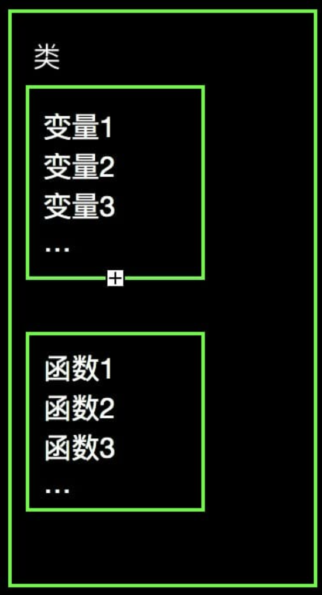
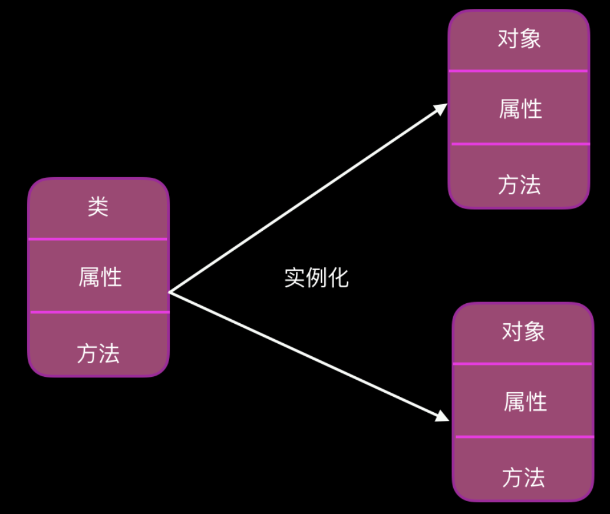

# 面向对象

时间：`2025年10月21日`

## 1. 面向对象的编程

### 面向对象基本概念的简要介绍

编程语言中，一般有两种编程思维：面向过程和面向对象

- **面向过程的编程 (Procedural Programming)**：
  - 以过程（或函数）为中心，程序是一系列要执行的步骤（函数调用）的集合
  - 数据和操作数据的函数是分离的。程序员需要详细地规划出解决问题的每一个步骤，然后用函数来实现这些步骤。
- **面向对象的编程 (Object-Oriented Programming, OOP)**：
  - 以对象（Object）为中心，将现实世界的事物抽象成程序中的对象。程序是一系列对象之间相互协作、发送消息的集合。
  - **数据和操作数据的逻辑被封装在一起，成为一个不可分割的整体——对象**
  - 在解决实际问题的过程中，可以把构成问题事务分解成各个对象

面向对象都有两个基本的概念：类和对象

- **类**：用来描述**具有相同的属性和方法的对象的集合**。
  - 它**定义了该集合中每个对象所共有的属性和方法**
  - **对象是类的实例**
  - 在Python中，**类本身就是一个对象**
- **对象**：通过类定义的数据结构实例

### 面向对象的三大特性

面向对象的编程语言有三大特性：继承，多态和封装性

- **继承**：一个 **派生类（derived class）** 继承 **基类（base class）** 的字段和方法
  - 继承也允许把一个派生类的对象作为一个基类对象对待
  - 这是模拟 **"is-a" 关系**（Cf.[7A-OOP相关的哲学与逻辑学](./7A-OOP相关的哲学与逻辑学.md)）
- **多态**：对不同类型的变量进行相同的操作，会根据对象（或类）类型的不同而表现出不同的行为
- **封装性**：
  - “封装”就是将抽象得到的数据和行为（或功能）相结合，形成一个有机的整体（即类）；
  - 封装的目的是增强安全性和简化编程，使用者不必了解具体的实现细节，只要通过外部接口和一特定的访问权限来使用类的成员。

---

## 2. 类的定义和基本语法

### 定义

- 类是变量和函数的一个集合<br>
  - 类中的变量称为**属性（Attributes）**：调用格式 `类.变量`
  - 类中的函数称为**方法（Methods）**：调用格式 `类.函数()`
- 包装函数和变量不是任意的，而是需要把同性质的包装在一个类里，以便于重复使用

### 基本语法

- 创建类：

  ```python
  class ClassName():
      <statement-1>
      .
      .
      .
      <statement-N>
  ```

  - 类比 `def()` 定义函数
  - 示例：

    ```python
    class ClassA():
        var1 = 100
        var2 = 0.01
        var3 = '嘿嘿嘿哈'

        def fun1():
            print('我是 fun1')

        def fun2():
            print('我是 fun2')

        def fun3():
            print('我是 fun3')
    ```

- 调用属性和方法

  ```python
  print(ClassA.var1)
  print(ClassA.var2)
  print(ClassA.var3)
  ClassA.fun1()
  ClassA.fun2()
  ClassA.fun3()
  ```

---

## 3. 类和对象

### 类和对象之间的关系

- 类相对于工厂里面的模具，对象就是根据模具制造出来的产品。从模具变成产品的过程，就被称为类的实例化。
- 类实例化后，就变为对象

### 类的实例化

- 类的实例化就是使用类作为模板，在内存中创建一个具体的、独立的对象的过程
- 实例化的语法：
  - 实例化的语法非常直观，看起来就像调用一个函数
  - `variable_name = ClassName()`
- 示例：

  ```python
  class ClassA():
    var1 = 100

    def fun1():
      print('hello')

  # 实例化
  a = ClassA()
  # 实例化之后调用属性
  print(a.var1)
  # 实例化之后使用方法
  a.fun1()
  ```

### **类属性、实例属性 & 类方法、实例方法**

- **类属性 (Class Attribute)**: 绑定到类本身，被所有实例共享
- **实例属性 (Instance Attribute)**: 绑定到具体的实例上，每个实例独有
- **类方法**：操作与整个类相关的状态和行为，**它的工作不依赖于任何一个具体的实例**。
- **实例方法**：操作“具体的实例”的状态和行为，**它的工作离不开某个具体的对象**。

  

### 类方法与实例方法的语法

**类方法：**

```python
class ClassB():
  var1 = 'AAA'

  @classmethod
  def fun1(cls, age):
    print('fun1' + cls.var1)
    print(f'Age is {age}')
```

- `@classmethod` 装饰器：声明类方法：这个装饰器告诉Python，你正在定义一个类方法
- `cls` 参数：
  - 当你调用一个类方法时，Python会自动将**类对象本身**作为第一个参数传递给这个方法。按照惯例，这个参数被命名为 cls ( "class" 的缩写)
  - 第一个参数为 `cls`，后面要继续传参的话，就和普通函数一样

**实例方法：**

```python
class ClassB():
  var1 = 'AAA'

  def fun1(self):
    print('fun1' + self.var1)
```

- 不需要 `@classmethod` 装饰器
- 参数 `cls` 改为 `self`
  - Python 会自动将实例对象本身作为第一个参数传入，我们**约定俗成地**（其实叫什么都可以，不论叫什么，传入的第一个参数都是它；只不过通常都叫这个）把它命名为 `self`
  - `self` 代表的是“我这个具体的对象”
- 类的使用，变成了先通过 `实例名 = 类()` 的方式实例化对象，为类创建一个实例，然后再使用 `实例名.函数()` 的方式调用对应的方法 

---

## 4. 修改/增加属性或方法

- 类属性改变，实例属性跟着改变；实例属性改变，类属性不变
- 类方法改变（见下），实例方法跟着改变；实例方法不能自己改变

### 修改/增加类属性

- **从内部增加和修改**：使用类方法进行修改

  ```python
  class ClassC():
    var1 = 'CCC'

    @classmethod
    def alt_var(cls):
      print(f'initial: {var1}')
      cls.var1 = input('change var1:') # 修改
      print(f'after change: {var1}')
      cls.var2 = input('add var2:') # 增加

  ClassC.fun1()
  ```

- **从外部增加和修改**：直接修改

  ```python
  class ClassC():
    var1 = 'CCC'

    @classmethod
    def fun1(cls):
      print(cls.var1)

  ClassC.fun1()
  ClassC.var1 = input('change var1?') # 修改
  ClassC.fun1()
  ClassC.var2 = input('add var2?') # 增加
  ```

### 修改类方法

- 需要先在外部定义一个新的函数，才能实现修改
  - 而实例方法不支持修改
- 示例如下：

  ```python
  class ClassX():
    var1 = 'XXX'

    def funX(self):
      print('mimimimimimi')

  # 实例化
  x = ClassX()

  # 修改方法 funX
  # 需要先创建一个新的函数
  def funNew(self):
    print('nahnahnahnah')

  # 合法的：重写（修改）类方法
  ClassX.funX = funNew

  # 不合法的：重写（修改）实例方法
  x.funX = funNew
  ```

- 注意：
  - 使用了 `类.原始函数 = 新函数` 进行了重写
  - 这里的赋值是在替换方法，并不是调用函数。所以不能加括号，也就是 `类.原始函数() = 新函数()` 这个写法是错误的

### 修改实例属性

直接赋值修改即可

```python
x.var1 = 'yyy'
```

---

## 5. 初始化函数与析构函数

### 初始化函数

- 初始化函数：创建实例时会被调用的函数
  - 当代码在执行 `a = ClassA()` 的语句（即使用类名创建实例）时，就自动调用了 `__init__(self)` 函数；其主要工作是为这个新对象设置初始状态，也就是给它的属性（如 self.name, self.age 等）赋予初始值
  - `__init__(self)` 即初始化函数，也叫构造函数
- 语法：前后都要有**两个下划线**，然后 `__init__()` 的括号中，第一个参数一定要写上 `self`，不然会报错
- 初始化函数可以传递参数：`def __init__(self,[...):`

  ```python
  class ClassA():

    def __init__(self,var1):
      print('success!')
      print(var1)
  ```

### 析构函数

- 析构函数：实例被销毁前调用的函数
- 语法: `def __del__(self,[...):`

---

## 6. 类的继承

### 基本介绍

- **继承**是一种允许我们创建一个新类（称为子类或派生类）的机制，这个新类可以获取一个已存在的类（称为父类、基类或超类）的属性和方法，而无需重写代码
  - 核心思想： 代码复用和逻辑层次（Cf.[7A-OOP相关的哲学与逻辑学](./7A-OOP相关的哲学与逻辑学.md)）
- 基本语法：

  ```python
  class ClassName(BaseClassName):
      <statement-1>
      .
      .
      .
      <statement-N>
  ```

  - 在定义类的时候，可以在括号里写继承的类，如果不用继承类的时候，也要写继承 object 类，因为在 Python 中 object 类是一切类的父类
- Python 同样也支持多继承，语法如下

  ```python
  class ClassName(Base1,Base2,Base3):
      <statement-1>
      .
      .
      .
      <statement-N>
  ```

- 子类可以进行自定义，覆盖父类的属性和方法

### 继承的特点

- 调用父类的方法：一个类继承了父类后，可以直接调用父类的方法的（父类有啥方法直接掉就行，示例省略）
- 调用父类的方法：在子类中重写父类的方法，就是直接在子类中定义一个与父类同名（包括参数）的函数

### 子类的类型判断

<mark>使用 `isinstance()` 函数</mark>

---

## 7. 类的多态

- 多态：对不同类型的变量进行相同的操作，会根据对象（或类）类型的不同而表现出不同的行为；例如：

  ```python
  >>> 1 + 2
  3
  >>> 'a' + 'b'
  'ab'
  ```

- **实现多态的核心前提**：在经典的面向对象模型中，实现多态通常需要满足两个基本条件：
  - **继承**：必须存在一个父类和多个子类。子类继承父类，这为它们提供了一个共同的基准。
  - **方法重写 (Override)**：每个子类必须重写父类中定义的同名方法，提供自己独特的实现
- **类的多态**：
  - 有一父类 $P$，其中有一个方法 $f_p$；
  - 另有两个继承$P$的子类$F1'$和$F1''$，并且它们分别对 $f_p$ 进行重写为 $f_p'$ 和 $f_p''$；
  - 有一函数 $A$，要求传入 $P$、并在内部调用 $f_p$
  - 当传入 $F1'$时，$A$ 就会自动调用 $f_p'$，传入 $F1''$，$A$ 就会自动调用 $f_p''$

---

<mark>第九课：类的访问控制、类的访问控制、方法的访问控制</mark>还没看

```python

```

```python

```