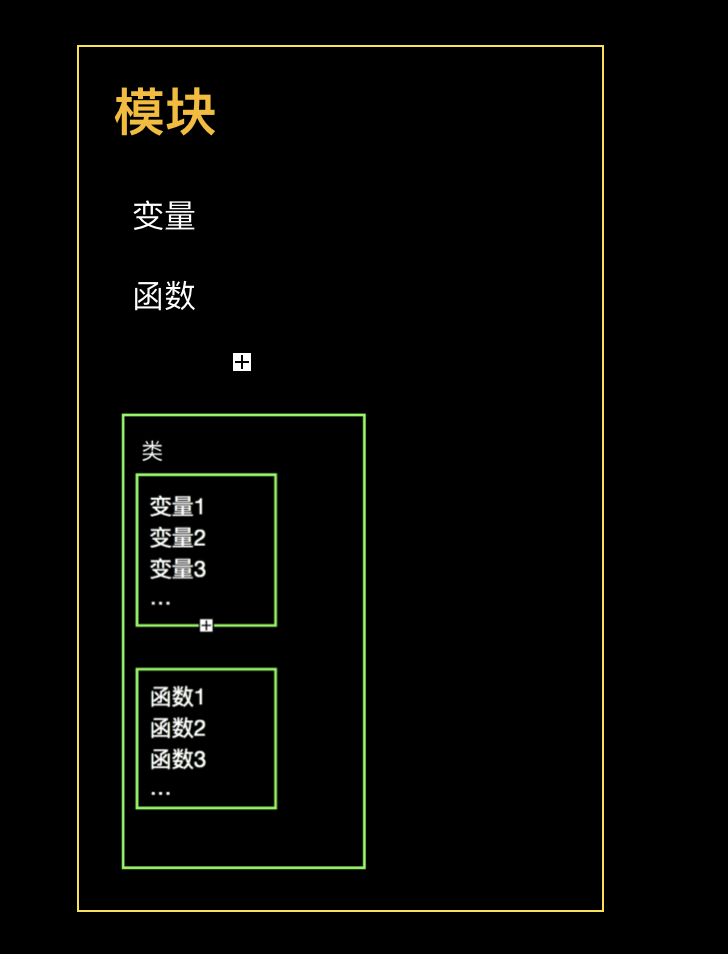

# 模块与包

时间：`2025年10月22日`

- 在开发过程中，随着程序代码越写越多，在一个文件里的代码越来越长、越来越不容易维护
- 后面我们学习了函数，知道函数是实现一项或多项功能的一段程序，这样就更方便我们重复使用代码
- 紧接着，我们学习了类，类可以封装方法和变量（属性）。这样就更方便我们维护代码了
- 再进一步，就是今天要介绍的模块

## 1. 模块（Module）简介

### 定义

- 模块存放内容：可以直接存放变量、函数和类<br>
- 封装：函数封装是 `def`，类封装用的是 `class`；而模块不需要特定的封装语句，一个 `.py` 文件就是一个模块
- 模块是函数功能的拓展
  - 模块是实现一项或多项功能的程序块
  - 模块的范围比函数广，在模块中，可以有多个函数
- Python 本身就内置了很多非常有用的模块，只要安装完毕，这些模块就可以立刻使用

### 标准库模块和自定义模块

Python 的模块分为标准库模块和自定义模块

- 标准库模块
  - 是随Python解释器一同安装的、立即可用的模块集合。它们是Python核心的一部分，由Python的开发团队维护，提供了广泛的、经过验证的功能
  - 在 Lib 目录下
- 自定义模块
  - 自定义模块是由程序员自己创建的 `.py` 文件，用于组织和复用自己的代码。当你的项目变得复杂时，将相关的函数、类和变量放入独立的模块中，可以让主程序更简洁，代码结构更清晰。

### 模块的优点

- 提高了代码的可维护性
- 使得编写代码不必从零开始；当一个模块编写完毕，就可以被其他地方引用
- 可以避免函数名和变量名冲突。相同名字的函数和变量可以分别存在不同的模块中

---

## 2. 模块的使用

### `import`

- 在使用某个模块之前，必须要导入这个模块
  - 一个模块只会被导入一次，不管执行了多少次 import
- 语法：

    ```python
    import module1[, module2[,... moduleN]
    ```

- python 解释器如何找到对应的 `.py` 文件？
  - python的搜索路径 `sys.path`
  - 搜索路径是由一系列目录名组成的，Python 解释器依次从这些目录中去寻找所引入的模块
  - 其顺序是：
    - `main.py` 所在的目录
    - `PYTHONPATH` 环境变量
    - 标准库目录
    - 第三方库目录

### `from···import`

- `from···import` 用于直接导入某个模块中的属性或者方法
- 语法：

    ```python
    from modname import name1[, name2[, ... nameN]]
    ```

  - `from ··· import *` 可以把某个模块中的所有方法属性都导入
  - 但是，这个方法会污染命名空间、可读性极差；因此几乎从不在正式项目中使用。仅用于交互式环境的快速探索。
- `from···import` 和 `import` 的区别
  - `import module`: 导入整个模块对象。需要通过 `module_name.thing_name` 的方式来访问模块内的函数、类或变量
  - `from module import thing`: 只导入模块中特定的函数、类或变量。你可以直接通过 `thing_name` 来访问，无需模块名前缀

---

## 3. 主模块和非主模块

### 主函数、非主函数，主模块、非主模块

- **主模块**：直接通过命令行 `python your_script.py` 运行的那个 `.py` 文件。它是整个程序的入口点 (Entry Point)
  - 在一个项目的一次运行中，永远只有一个主模块
- **非主模块**：所有被 `import` 语句加载到其他模块中的 `.py` 文件。它们作为代码库、工具箱或功能库被使用
- **主函数**：调用其他函数而不被调用的函数
  - 这是程序员为了代码组织和可读性而约定的，是一种广泛遵循的最佳实践，而不是Python的强制语法
  - 主函数通常被命名为 `main()`，它是一个普通的Python函数。它的特殊之处在于，它被设计用来包含和组织主模块的主要执行逻辑
- **非主函数**：除了主函数之外其他所有的函数

### name 属性

- 如何区分主模块和非主模块？使用 `__name__` 属性
- 语法：

    ```python
    if __name__ == '__main__'
    ```

  - 如果属性为 `'__main__'`，那么就是主模块；
  - 注意：这里是字符串 `'__main__'`，而不是 `__main__`
  - `__main__` 属性只是帮助判断是否是主模块，并不是说这个属性决定其是否是主模块，**决定是否是主模块的条件只是这个模块有没有被人调用**

---

## 4. 包（Package）

### 定义

- **包**是一种将相关的模块 (Modules) 组织到一个目录层次结构中的方式
  - 一个包含模块的目录 (文件夹) 就是一个包
- 目的：解决了当项目变得复杂时，将所有 `.py` 文件都放在同一目录下导致的混乱和命名冲突问题（因为放到包里之后文件路径就不同了）
  - `name.py` 引入包之前的模块名：`name`
  - `name.py` 引入包之后的模块名：`path.name`

### 包的结构与标志

- **标志：**
  - 一个目录要被Python识别为一个包，最关键的标志是它内部包含一个特殊文件：`__init__.py`
  - `__init__.py` 文件的作用
    - 作为包的标志
    - 执行包的初始化代码
    - 定义包的公共API
- **结构：** 一个典型的包结构示例

    ```
    my_project/
    ├── main.py                 # 主程序文件
    └── ecommerce/              # 这是一个名为 "ecommerce" 的包
        ├── __init__.py         # 包的标志文件
        ├── products.py         # 模块：处理产品逻辑
        ├── payments.py         # 模块：处理支付逻辑
        └── sub_package/        # 包里面还可以有子包
            ├── __init__.py
            └── reports.py      # 子包中的模块
    ```

  - `ecommerce` 是一个顶级包
  - `ecommerce/sub_package` 是一个子包
  - `products.py`, `payments.py`, `reports.py` 都是包内的模块。

---

## <mark>5. 作用域、private</mark>

### <mark>作用域（Scope）的概念</mark>

- **作用域** 是程序中一个变量、函数或其他标识符（名字）可以被有效访问的区域。它本质上定义了一个“名字”的可见性和生命周期
  - 作用域回答了这样一个问题：“在代码的这个位置，我能使用变量 `x` 吗？”
- 作用域的目的：
  - 增强安全性和封装性：通过限制对变量的访问，作用域可以保护数据不被外部代码随意修改


### 非公开的函数/变量名

- 在Python中，以单个前导下划线 `_` 或者双前导下划线 `__` 开头的名称，如 `_my_variable`, `__helper_function`，是 **“非公开的（private）”**
  - 这是一种**命名约定**；非公开”并不意味着“私有” (private) 或“无法访问”。Python没有像Java或C++那样强制的私有性。“非公开”是一个信号或君子协定
  - 在Python中，任何不以单下划线或双下划线开头的变量、函数或方法，都被默认为是**公开的 (Public)**
- *当使用通配符导入 (`from module import *`) 时，以 `_` 开头的名称不会被导入*
- 外部不需要引用的函数全部定义成 private，只有外部需要引用的函数才定义为 public
- 示例：

    ```python
    #!/usr/bin/env python3
    # -*- coding: UTF-8 -*-

    def _diamond_vip(lv):
        print('尊敬的钻石会员用户，您好')
        vip_name = 'DiamondVIP' + str(lv)
        return vip_name

    def _gold_vip(lv):
        print('尊敬的黄金会员用户，您好')
        vip_name = 'GoldVIP' + str(lv)
        return vip_name

    def vip_lv_name(lv):
        if lv == 1:
            print(_gold_vip(lv))
        elif lv == 2:
            print(_diamond_vip(lv))

    vip_lv_name(2)
    ```

  - 在这个模块中，我们公开 `vip_lv_name` 方法函数，而其他内部的逻辑分别在 `_diamond_vip` 和 `_gold_vip private` 函数中实现
  - 因为是内部实现逻辑，调用者根本不需要关心这个函数方法，它只需关心调用 `vip_lv_name` 的方法函数，所以用 private 是非常有用的代码封装和抽象的方法    

