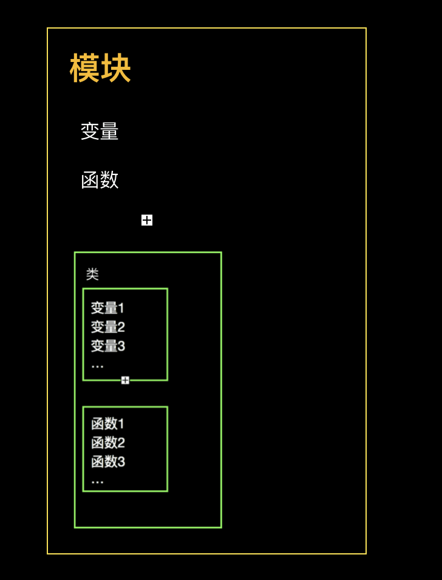
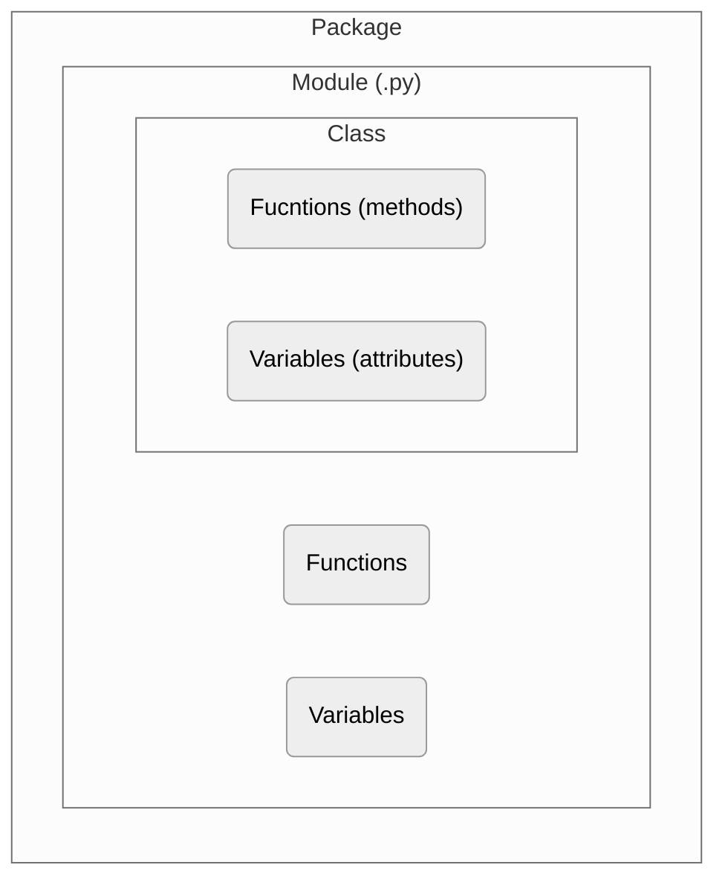

# 模块与包

时间：`2026年8月12日`

在开发过程中，随着程序代码越写越多，在一个文件里的代码越来越长、越来越不容易维护

- 函数：是实现一项或多项功能的一段程序，这样就更方便我们重复使用代码
- 类：类可以封装方法和变量（属性）。这样就更方便我们维护代码
- 再进一步，就是今天要介绍的模块

## 1. 模块（Module）简介

### 定义

- 模块负责存放内容：可以直接存放变量、函数和类<br>
- **封装**：函数封装是 `def`，类封装用的是 `class`；而模块不需要特定的封装语句，一个 `.py` 文件就是一个模块
- 模块是函数功能的拓展
  - 模块是实现一项或多项功能的程序块
  - 模块的范围比函数广，在模块中，可以有多个函数
- Python 本身就内置了很多非常有用的模块，只要安装完毕，这些模块就可以立刻使用

### 标准库模块和自定义模块

Python 的模块分为标准库模块和自定义模块

- **标准库模块**
  - 是随Python解释器一同安装的、立即可用的模块集合。它们是Python核心的一部分，由Python的开发团队维护，提供了广泛的、经过验证的功能
  - 在 `Lib` 目录下
- **自定义模块** 
  - 自定义模块是由程序员自己创建的 `.py` 文件，用于组织和复用自己的代码。
  - 当你的项目变得复杂时，将相关的函数、类和变量放入独立的模块中，可以让主程序更简洁，代码结构更清晰。
- *简直和 `.skill` 如出一辙*
  - 两者解决的是同一个元问题：如何把复杂的系统拆分成可理解、可复用、可替换的单元？
  - Python 模块是"编译器时代的模块化"，Skill 是"自然语言时代的模块化"；它们共享同一套工程思想

### 模块的优点

- 提高了代码的可维护性
- **使得编写代码不必从零开始**（*防止重复造轮子*）；当一个模块编写完毕，就可以被其他地方引用
- 可以避免函数名和变量名冲突。相同名字的函数和变量可以分别存在不同的模块中

---

## 2. 模块的使用

### `import`

- 在使用某个模块之前，必须要导入这个模块
  - 一个模块只会被导入一次，不管执行了多少次 import
- 语法：

    ```python
    import module1[, module2[,... moduleN]
    ```

- python 解释器如何找到对应的 `.py` 文件？
  - python的搜索路径 `sys.path`
  - 搜索路径是由一系列目录名组成的，Python 解释器依次从这些目录中去寻找所引入的模块
  - 其顺序是：
    - `main.py` 所在的目录
    - `PYTHONPATH` 环境变量
    - 标准库目录
    - 第三方库目录

### `from···import`

- `from···import` 用于直接导入某个模块中的属性或者方法
- 语法：

    ```python
    from modname import name1[, name2[, ... nameN]]
    ```

  - `from ··· import *` 可以把某个模块中的所有方法属性都导入
  - 但是，这个方法会污染命名空间、可读性极差；因此几乎从不在正式项目中使用。仅用于交互式环境的快速探索。
- **`from···import` 和 `import` 的区别**
  - `import module`: 导入整个模块对象。需要通过 `module_name.thing_name` 的方式来访问模块内的函数、类或变量
  - `from module import thing`: 只导入模块中特定的函数、类或变量。你可以直接通过 `thing_name` 来访问，无需模块名前缀

### 常用的标准库模块

- `os` 与 `pathlib` 模块：这两个模块是处理文件和目录的基础。
  - `os` 模块提供了与操作系统交互的底层接口，
  - `pathlib` 提供了更现代化、更面向对象的路径操作方式
- `datetime` 模块：提供了处理日期、时间和时间间隔的类，是处理时间相关任务的必备工具
- `random` 模块：用于生成各种类型的伪随机数，广泛用于模拟、游戏、随机抽样等场景
- `statistics` 模块：基础统计计算。提供了直接计算描述性统计量（Descriptive Statistics）的函数，如：`mean()` (平均值)、`median()` (中位数)等等
- `math` 模块：基本数学函数。提供了更高级的数学运算，如对数 (`log`)、平方根 (`sqrt`)、三角函数等。在进行数据转换（如对数变换）或实现自定义算法时会用到

---

## 3. 主模块和非主模块

### 主函数、非主函数，主模块、非主模块

- **主模块**：直接通过命令行 `python your_script.py` 运行的那个 `.py` 文件。它是整个程序的入口点 (Entry Point)
  - 在一个项目的一次运行中，永远只有一个主模块
- **非主模块**：所有被 `import` 语句加载到其他模块中的 `.py` 文件。它们作为代码库、工具箱或功能库被使用
- **主函数**：调用其他函数而不被调用的函数
  - 这是程序员为了代码组织和可读性而约定的，是一种广泛遵循的最佳实践，而不是Python的强制语法
  - 主函数通常被命名为 `main()`，它是一个普通的Python函数。它的特殊之处在于，它被设计用来包含和组织主模块的主要执行逻辑
- **非主函数**：除了主函数之外其他所有的函数

### name 属性

- 如何区分主模块和非主模块？使用 `__name__` 属性
- 语法：

    ```python
    if __name__ == '__main__'
    ```

  - 如果属性为 `'__main__'`，那么就是主模块；
  - 注意：这里是字符串 `'__main__'`，而不是 `__main__`
  - `__main__` 属性只是帮助判断是否是主模块，并不是说这个属性决定其是否是主模块，**决定是否是主模块的条件只是这个模块有没有被人调用**

---

## 4. 包（Package）

### 定义

- **包**是一种将相关的模块 (Modules) 组织到一个目录层次结构中的方式
  - 一个包含模块的目录 (文件夹) 就是一个包
  -  Package 属于代码层面的[[目录结构设计]]
- 目的：解决了当项目变得复杂时，将所有 `.py` 文件都放在同一目录下导致的混乱和命名冲突问题（因为放到包里之后文件路径就不同了）
  - `name.py` 引入包之前的模块名：`name`
  - `name.py` 引入包之后的模块名：`path.name`

### 包的结构与标志

- **标志：**
  - 一个目录要被 Python 识别为一个包，最关键的标志是它内部包含一个特殊文件：`__init__.py`
  - `__init__.py` 文件的**作用**
    - 作为包的标志
    - 执行包的初始化代码
    - 定义包的公共 API
- **结构：** 一个典型的包结构示例

    ```
    my_project/
    ├── main.py                 # 主程序文件
    └── ecommerce/              # 这是一个名为 "ecommerce" 的包
        ├── __init__.py         # 包的标志文件
        ├── products.py         # 模块：处理产品逻辑
        ├── payments.py         # 模块：处理支付逻辑
        └── sub_package/        # 包里面还可以有子包
            ├── __init__.py
            └── reports.py      # 子包中的模块
    ```

  - `ecommerce` 是一个顶级包
  - `ecommerce/sub_package` 是一个子包
    - 注意以上两者，包内均有 `__init__.py`
  - `products.py`, `payments.py`, `reports.py` 都是包内的模块。

---

## 5. 总结：组织结构


```mermaid

%%{
  init{
    'theme':'neutral'
  }
}%%

graph LR
  subgraph A[Package]
    subgraph B["Module (.py)"]
      subgraph C1[Class]
        D("Fucntions (methods)")
        E("Variables (attributes)")
      end
      C2(Functions)
      C3(Variables)
    end
  end
```

