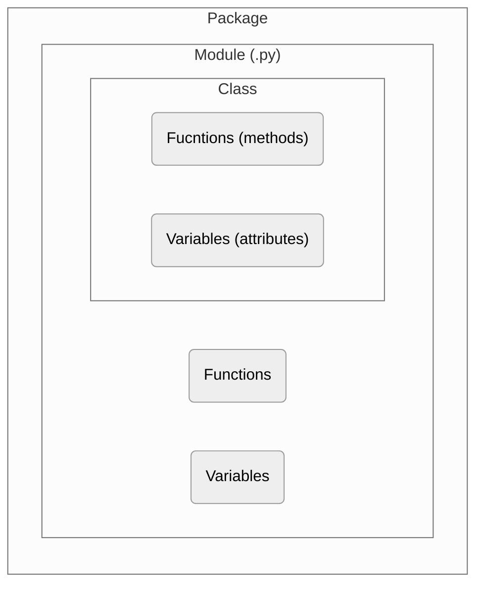

# 模块与包

时间：`2026年8月12日`

在开发过程中，随着程序代码越写越多，在一个文件里的代码越来越长、越来越不容易维护

1. 函数：是实现一项或多项功能的一段程序，这样就更方便我们重复使用代码
2. 类：类可以封装函数（方法）和变量（属性）。这样就更方便我们维护代码
3. 再进一步，就是今天要介绍的模块

## 1. 模块（Module）简介

### 定义

- 模块负责存放内容：可以直接存放变量、函数和类<br>
- **封装**：函数封装是 `def`，类封装用的是 `class`；而**模块不需要特定的封装语句，一个 `.py` 文件就是一个模块**
- 模块是函数功能的拓展
  - 模块是实现一项或多项功能的程序块
  - 模块的范围比函数广，在模块中，可以有多个函数
- Python 本身就内置了很多非常有用的模块，只要安装完毕，这些模块就可以立刻使用

### 库（Library）：模块和包的统称

- **库**是对"拿来即用的代码集合"的总称，一个库可以是**单个模块**、**一个包**，也可以是**一组包的集合**
- 模块是代码组织的最小单元（一个 `.py` 文件），包是目录级的组织方式（带 `__init__.py` 的目录），库是站在**用途角度**对二者的统称
- "标准库 / 第三方库"里的"库"就是这个含义

### 标准库模块和自定义模块

Python 的模块分为标准库模块和自定义模块

- **标准库模块**
  - 是随Python解释器一同安装的、立即可用的模块集合。它们是Python核心的一部分，由Python的开发团队维护，提供了广泛的、经过验证的功能
  - 在 `Lib` 目录下
- **第三方库模块**
  - 由社区或其他组织开发，需要额外安装（`pip install`）才能使用
  - 一般安装在解释器目录的 `Lib\site-packages` 下，如 `numpy`、`jieba`、`requests`
- **自定义模块** 
  - 自定义模块是由程序员自己创建的 `.py` 文件，用于组织和复用自己的代码。
  - 当你的项目变得复杂时，将相关的函数、类和变量放入独立的模块中，可以让主程序更简洁，代码结构更清晰。
- *简直和 `.skill` 如出一辙*
  - 两者解决的是同一个元问题：如何把复杂的系统拆分成可理解、可复用、可替换的单元？
  - **Python 模块是"编译器时代的模块化"，Skill 是“自然语言时代的模块化”；它们共享同一套工程思想**

### 模块的优点

- 提高了代码的可维护性
- **使得编写代码不必从零开始**（*防止重复造轮子*）；当一个模块编写完毕，就可以被其他地方引用
- 可以避免函数名和变量名冲突。相同名字的函数和变量可以分别存在不同的模块中

---

## 2. 模块的使用

### `import`

- 在使用某个模块之前，必须要导入这个模块
  - 一个模块只会被导入一次，不管执行了多少次 import
- 语法：

    ```python
    import module1[, module2[,... moduleN]
    ```

  - 给模块起别名：`import module as m` → 可以通过 `m.thing()` 来访问模块内的函数、类或变量
- python 解释器如何找到对应的 `.py` 文件？
  - Python 的搜索路径 `sys.path`
  - 搜索路径是由一系列目录名组成的，Python 解释器依次从这些目录中去寻找所引入的模块；其顺序是：
    - **`main.py` 所在的目录**
    - `PYTHONPATH` 环境变量，参见[环境变量笔记](./0.3-环境&虚拟环境.md)
    - 标准库目录
    - 第三方库目录

### `from···import`

- `from···import` 用于直接导入某个模块中的属性或者方法
- 语法：

    ```python
    from modname import name1[, name2[, ... nameN]]
    ```

  - `from ··· import *` 可以把某个模块中的所有方法属性都导入
  - **`import *` 的具体问题**
    - **命名空间污染**：模块中所有公开名字一次性倒入当前命名空间，你无法预知到底导入了什么
    - **静默覆盖**：如果模块里的名字和你已用的变量名/函数名相同，会被悄悄覆盖，产生极难排查的 bug（如 `from math import *` 会覆盖你自己定义的 `pi`）
    - **来源不可追溯**：看到 `sqrt(...)` 却不知道它来自哪个模块，静态检查工具（IDE、linter）也难以提示
- **`from···import` 和 `import` 的区别**
  - `import module`: 导入整个模块对象。需要通过 `module_name.thing_name` 的方式来访问模块内的函数、类或变量
  - `from module import thing`: 只导入模块中特定的函数、类或变量。你可以直接通过 `thing_name` 来访问，无需模块名前缀
- **哪些写法可以省略 `模块名.` 前缀？**
  - `from module import thing` → 直接写 `thing()`
  - `from module import thing as t` → 直接写 `t()`（连模块名都没有，只剩自定义别名）
  - `from module import *` → 所有公开名字直接使用（强烈不推荐，见上）
  - 反例：`import module` 和 `import module as m` 都必须带前缀（`module.thing()` / `m.thing()`）

### `import ... as`（别名）

- 语法：

    ```python
    import modulename as alias
    from modulename import name1 as alias1[, name2 as alias2]
    ```

- 用途：
  - 模块名太长时，用别名简化调用，如 `import statistics as stats`，之后写 `stats.mean(...)`
  - 模块名与程序中已有的变量名/函数名冲突时，用别名避免冲突
- 注意：起了别名之后，原来的模块名就不能再使用了

### 从自定义模块导入

- 自己写的 `.py` 文件就是自定义模块，只要它位于搜索路径（`sys.path`，最常见的是与主模块同目录）中，就可以像标准库一样被导入
- 示例：同目录下有 `mymodule.py`，内含 `def hello(): ...`，在 `main.py` 中：

    ```python
    import mymodule              # 调用时须写：mymodule.hello()
    from mymodule import hello   # 调用时直接写：hello()，无需前缀
    ```

---

## 3. 主模块和非主模块

### 主函数、非主函数，主模块、非主模块

- **主模块**：直接通过命令行 `python your_script.py` 运行的那个 `.py` 文件。它是整个程序的入口点 (Entry Point)
  - 在一个项目的一次运行中，永远只有一个主模块
- **非主模块**：所有被 `import` 语句加载到其他模块中的 `.py` 文件。它们作为代码库、工具箱或功能库被使用
- **主函数**：调用其他函数而不被调用的函数
  - 这是程序员为了代码组织和可读性而约定的，是一种广泛遵循的最佳实践，而不是Python的强制语法
  - 主函数通常被命名为 `main()`，它是一个普通的Python函数。它的特殊之处在于，它被设计用来包含和组织主模块的主要执行逻辑
- **非主函数**：除了主函数之外其他所有的函数

### name 属性

- 如何区分主模块和非主模块？使用 `__name__` 属性
- 语法：

    ```python
    if __name__ == '__main__'
    ```

  - 如果属性为 `'__main__'`，那么就是主模块；
  - 注意：这里是字符串 `'__main__'`，而不是 `__main__`
  - `__main__` 属性只是帮助判断是否是主模块，并不是说这个属性决定其是否是主模块，**决定是否是主模块的条件只是这个模块有没有被人调用**

---

## 4. 包（Package）

### 定义

- **包**是一种将相关的模块 (Modules) 组织到一个目录层次结构中的方式
  - 一个包含模块的目录 (文件夹) 就是一个包
  -  Package 属于代码层面的[[目录结构设计]]
- 目的：解决了当项目变得复杂时，将所有 `.py` 文件都放在同一目录下导致的混乱和命名冲突问题（因为放到包里之后文件路径就不同了）
  - `name.py` 引入包之前的模块名：`name`
  - `name.py` 引入包之后的模块名：`path.name`

### 包的结构与标志

- **标志：**
  - 一个目录要被 Python 识别为一个包，最关键的标志是它内部包含一个特殊文件：`__init__.py`
  - `__init__.py` 文件的**作用**
    - 作为包的标志
    - 执行包的初始化代码
    - 定义包的公共 API
- **结构：** 一个典型的包结构示例

    ```
    my_project/
    ├── main.py                 # 主程序文件
    └── ecommerce/              # 这是一个名为 "ecommerce" 的包
        ├── __init__.py         # 包的标志文件
        ├── products.py         # 模块：处理产品逻辑
        ├── payments.py         # 模块：处理支付逻辑
        └── sub_package/        # 包里面还可以有子包
            ├── __init__.py
            └── reports.py      # 子包中的模块
    ```

  - `ecommerce` 是一个顶级包
  - `ecommerce/sub_package` 是一个子包
    - 注意以上两者，包内均有 `__init__.py`
  - `products.py`, `payments.py`, `reports.py` 都是包内的模块。

---

## 5. 总结：组织结构

### 代码的完整层级

从小到大，Python 代码的组织层级为：

```
字面量/标记 → 表达式 → 语句 → 代码块 → 函数/类 → 模块 → 包 → 程序
（词法层）  （求值）  （执行）（缩进划定）（定义单元） （文件）（目录）
```

| 层级 | 说明 |
|---|---|
| **表达式（expression）** | 能**计算出一个值**的单元（字面量、运算、调用、三元、lambda…），可放在 `=` 右边 |
| **语句（statement）** | 执行一个**动作**，不产生值；是 Python 程序的组成单位。分**简单语句**（赋值、`import`、`return`…）和**复合语句**（`if`/`for`/`def`/`class`，冒号+缩进） |
| **代码块（suite）** | 缩进划定的一组语句（见[笔记4A](./4A-冒号、缩进和语句顺序.md)） |
| **函数 / 类** | 代码的“定义单元”。`def`/`class` 本身是复合语句，但产出的函数、类是对象 |
| **模块（module）** | 一个 `.py` 文件 |
| **包（package）** | 带 `__init__.py` 的目录 |
| **程序** | 整个应用的入口（直接运行的那个主模块） |

- 关系：**表达式组成语句**（如 `x = 1 + 2` 中 `1 + 2` 是表达式、整体是赋值语句），**语句组成代码块**，代码块往上层层封装为函数/类、模块、包

### 结构图


```mermaid

%%{
  init{
    'theme':'neutral'
  }
}%%

graph LR
  subgraph A[Package]
    subgraph B["Module (.py)"]
      subgraph C1[Class]
        D("Fucntions (methods)")
        E("Variables (attributes)")
      end
      C2(Functions)
      C3(Variables)
    end
  end
```

